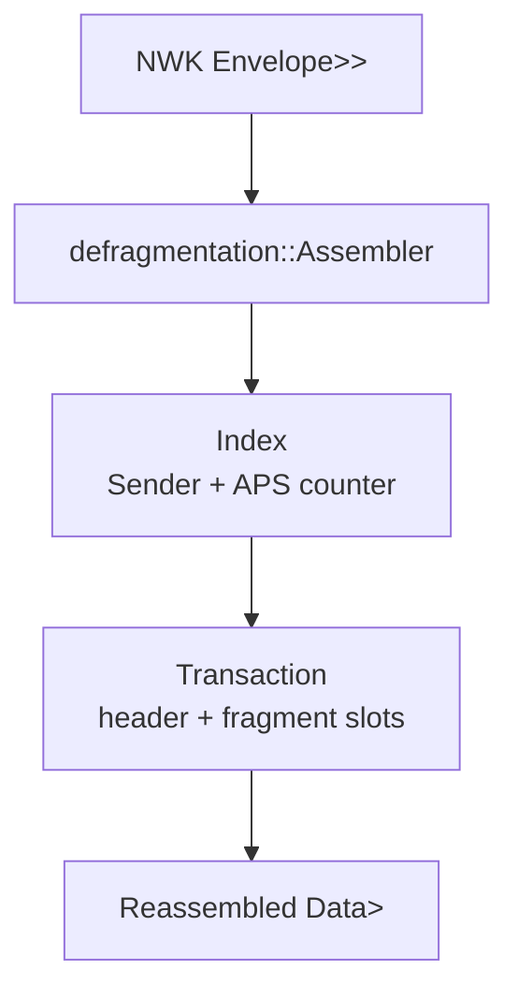

# apis-saltans-aps Architecture

`apis-saltans-aps` models Zigbee APS frames and provides stateful
defragmentation for raw APS data payloads.

## Frame Modules

| Module | Responsibility |
| --- | --- |
| `frame::control` | APS frame-control bitfields and delivery mode decoding. |
| `frame::data` | APS data headers and payload-carrying frame types. |
| `frame::command` | APS command frame/header structures. |
| `frame::acknowledgement` | APS acknowledgement frame structures. |
| `frame::extended` | Extended APS header fields, including fragmentation metadata. |
| `broadcast` | Well-known Zigbee broadcast addresses. |

## Defragmentation

`defragmentation::Assembler` owns a map of in-progress transactions. Each
transaction is keyed by:

- `apis_saltans_nwk::Sender`, because APS counters are sender-scoped;
- APS frame counter, because fragments of one APS frame share the counter.

The first fragment stores the original APS data header and opens the payload
slot vector. Follow-up fragments are inserted by block number. When every slot
is filled, the transaction concatenates all payload fragments, drops the
extended header from the saved data header, and returns a rebuilt
`Data<Box<[u8]>>`.

Invalid fragmentation states are intentionally drop-only:

- a frame marked as both first and follow-up fragment is rejected;
- fragmented frames without a block number are rejected;
- first fragments with total block count `0` are rejected;
- follow-up fragments without an existing transaction are rejected;
- out-of-bounds follow-up fragments drop the transaction.
