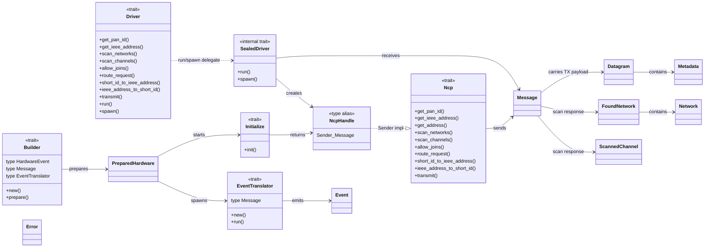
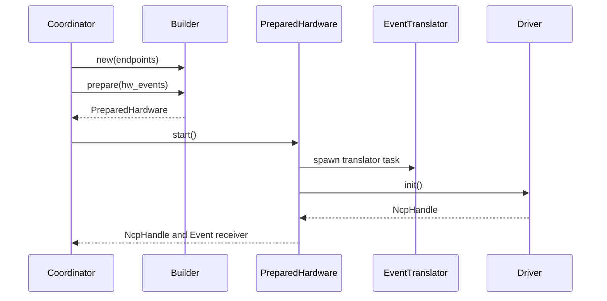
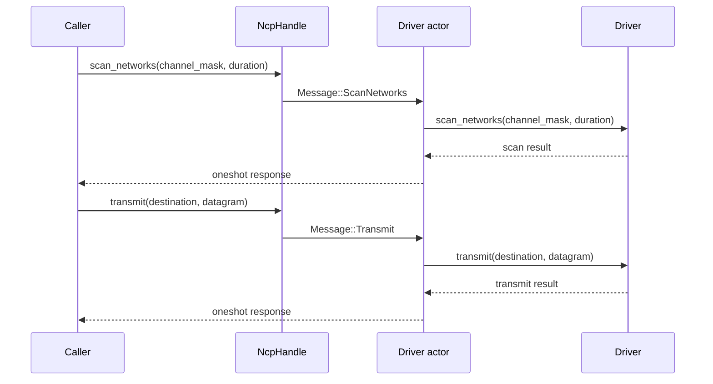
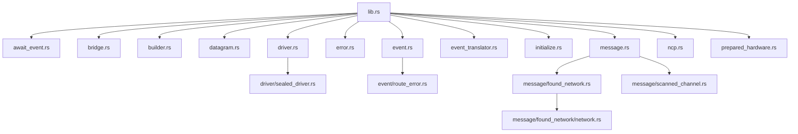

# apis-saltans-hw Architecture

`apis-saltans-hw` is the hardware abstraction crate between coordinator logic and concrete Zigbee
network co-processor (NCP) drivers. The crate is actor-oriented: callers hold an `NcpHandle`,
send internal `Message` commands through the `Ncp` trait, and receive responses through one-shot
channels owned by each message.

## Boundaries

- `Builder` creates a backend from the coordinator endpoint descriptors and prepares support tasks.
- `Initialize` starts the command side of a prepared backend and returns an `NcpHandle`.
- `Driver` is the implementor-facing NCP command API.
- `Ncp` is the caller-facing proxy API implemented for `tokio::sync::mpsc::Sender<Message>`.
- `EventTranslator` converts backend-specific event messages into common `Event` values.
- `Datagram` carries serialized application payload bytes together with APS `Metadata`.

## Public Re-Exports

| Export | Defined in | Purpose |
| --- | --- | --- |
| `AwaitEvent` | `await_event.rs` | Convenience methods for waiting on common network events. |
| `bridge` | `bridge.rs` | Forwards and converts messages between Tokio MPSC channels. |
| `Builder` | `builder.rs` | Prepares a hardware backend and its support tasks. |
| `Datagram` | `datagram.rs` | Serialized application payload plus APS metadata. |
| `Driver` | `driver.rs` | Driver-side command API implemented by hardware backends. |
| `Error` | `error.rs` | Common crate error type. |
| `Event` | `event.rs` | Common hardware-layer event model. |
| `EventTranslator` | `event_translator.rs` | Converts backend event messages into `Event` values. |
| `FoundNetwork` | `message/found_network.rs` | Network scan result plus last-hop signal quality. |
| `Initialize` | `initialize.rs` | Starts the command side of a prepared backend. |
| `Metadata` | `datagram.rs` | APS profile and cluster metadata for a `Datagram`. |
| `Ncp` | `ncp.rs` | Caller-side API implemented for `NcpHandle`. |
| `NcpHandle` | `lib.rs` | `tokio::sync::mpsc::Sender<Message>`, the actor command handle. |
| `Network` | `message/found_network/network.rs` | Basic network information discovered during scans. |
| `PreparedHardware` | `prepared_hardware.rs` | Prepared startup bundle containing support tasks and event stream. |
| `ScannedChannel` | `message/scanned_channel.rs` | Channel scan result. |

Internal modules define additional items used by the public API but not directly exported:

| Item | Defined in | Purpose |
| --- | --- | --- |
| `Message` | `message.rs` | Internal actor command protocol between `NcpHandle` and the driver actor. |
| `SealedDriver` | `driver/sealed_driver.rs` | Blanket-implemented actor runtime for every `Driver + Send + 'static`. |

## Component Relationships

## Startup Flow

## Actor Command Flow

Each proxy call maps to one internal `Message` and one driver call. Destination-specific delivery
semantics are represented by `apis_saltans_core::Destination`; the hardware abstraction no longer
has separate unicast, multicast, and broadcast actor messages.

## Module Inventory

## Command Protocol

`Message` is the private actor protocol carried by `NcpHandle`. Each variant owns a one-shot
response sender so the actor can return the result of the corresponding driver call.

| `Ncp` method | `Message` variant | `Driver` method |
| --- | --- | --- |
| `get_pan_id` | `GetPanId` | `get_pan_id` |
| `get_ieee_address` | `GetIeeeAddress` | `get_ieee_address` |
| `scan_networks` | `ScanNetworks` | `scan_networks` |
| `scan_channels` | `ScanChannels` | `scan_channels` |
| `allow_joins` | `AllowJoins` | `allow_joins` |
| `route_request` | `RouteRequest` | `route_request` |
| `short_id_to_ieee_address` | `TranslateIeeeAddress` | `short_id_to_ieee_address` |
| `ieee_address_to_short_id` | `TranslateShortId` | `ieee_address_to_short_id` |
| `transmit` | `Transmit` | `transmit` |

## Data Model

`Datagram` is the transmit payload passed to the driver. It contains:

- `Metadata`, which identifies the APS profile and cluster.
- `bytes::Bytes`, which contains the serialized application payload.

`Event` is the receive-side model emitted by the event translator. It reports network state changes,
device join/leave notifications, route errors, and raw received APS data as
`apis_saltans_nwk::Envelope<apis_saltans_aps::Data<bytes::Bytes>>`.

Scan commands use `FoundNetwork`, `Network`, and `ScannedChannel` to report network discovery and
channel activity results without exposing backend-specific scan response formats.

## Error Handling

`Error` is intentionally small:

- `Implementation` wraps backend-specific errors.
- `DriverSend` means the actor command channel was closed.
- `DriverRecv` means the one-shot response channel was closed.
- `NotImplemented` represents unsupported backend features.
- `NoEndpoints` represents startup without endpoint descriptors.
