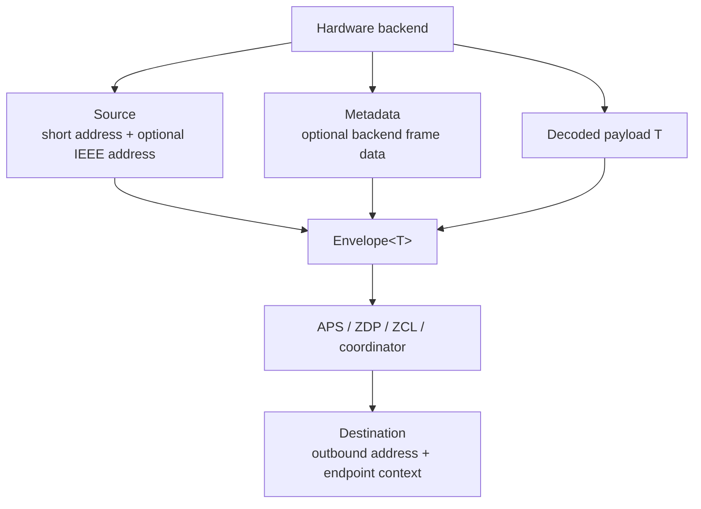
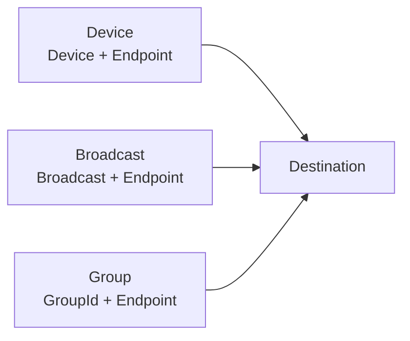

# apis-saltans-nwk Architecture

`apis-saltans-nwk` contains transport-neutral Zigbee NWK context types. It is a
boundary crate: hardware-facing code can attach network source and metadata to
received payloads, while protocol-facing code can describe outbound network
destinations without depending on a specific radio or NCP backend.

The crate intentionally does not parse NWK frames, perform routing, discover
devices, or dispatch application payloads. Those responsibilities live in the
hardware, APS, ZDP, ZCL, and coordinator crates.

## Modules

| Module | Public type | Responsibility |
| --- | --- | --- |
| `destination` | `Destination` | Describes outgoing device, broadcast, and group destinations using core address wrappers. |
| `source` | `Source` | Identifies the incoming NWK source by short address and optional IEEE address. |
| `metadata` | `Metadata` | Stores optional backend-provided frame metadata. |
| `envelope` | `Envelope<T>` | Couples a payload with source and metadata context. |

## Data Model

`Source` is the receive-side address context. It always stores the 16-bit short
address because that address scopes several higher-layer operations, including
APS counters and coordinator routing decisions. Its IEEE address is optional
because a receiver may need a discovery/cache lookup before it can resolve the
long address.

`Metadata` is deliberately additive and optional. A backend can report link
quality, RSSI, binding table information, or source-route overhead when it has
those values. Missing metadata is represented with `None` rather than sentinel
values.

`Envelope<T>` owns the received payload and the receive-side context together.
It is generic over `T` so the same wrapper can carry raw APS data, parsed ZDP or
ZCL messages, coordinator events, or tests' synthetic payloads. The crate does
not require `T` to implement any protocol trait.

`Destination` is the send-side counterpart. It distinguishes normal device
unicast, broadcast receiver sets, and APS group destinations while keeping the
endpoint context needed by the sender.

## Serialization

The crate is `no_std` by default. Optional features add derive-based
serialization support:

| Feature | Effect |
| --- | --- |
| `serde` | Derives `serde::Serialize` and `serde::Deserialize`. |
| `le-stream` | Derives `le_stream::FromLeStream` and `le_stream::ToLeStream`. |

`Source`, `Metadata`, and `Envelope<T>` derive those implementations when the
features are enabled. `Destination` currently keeps only the standard trait
derives because outbound destinations are converted by higher layers instead of
being serialized directly by this crate.

## Dependency Boundaries

`apis-saltans-nwk` depends on `apis-saltans-core` for shared Zigbee domain
types:

- `Broadcast`
- `Device`
- `Endpoint`
- `GroupId`
- `IeeeAddress`

The dependency does not point back to APS, ZDP, ZCL, coordinator, or hardware
crates. This keeps NWK context reusable across layers and prevents the simple
value types from becoming coupled to a specific frame parser or runtime.
