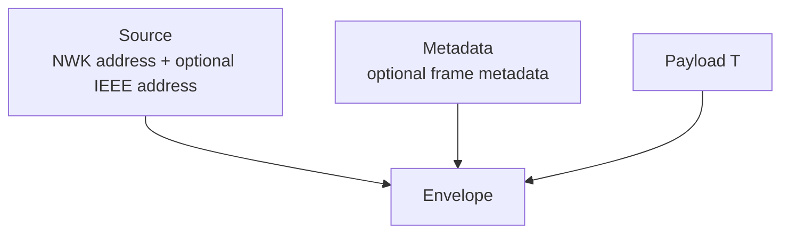

# apis-saltans-nwk Architecture

`apis-saltans-nwk` contains transport-neutral NWK context types. It does not
parse or dispatch NWK frames; instead, it provides reusable containers that
higher-level crates can attach to decoded payloads.

## Modules

| Module | Public type | Responsibility |
| --- | --- | --- |
| `source` | `Source` | Identifies the incoming NWK source by short address and optional IEEE address. |
| `metadata` | `Metadata` | Stores optional frame metadata provided by a backend. |
| `envelope` | `Envelope<T>` | Couples a payload with source and metadata context. |

## Serialization

The crate is `no_std` by default. Optional features add derive-based
serialization support:

| Feature | Effect |
| --- | --- |
| `serde` | Derives `serde::Serialize` and `serde::Deserialize`. |
| `le-stream` | Derives `le_stream::FromLeStream` and `le_stream::ToLeStream`. |

`Source` uses `apis_saltans_core::IeeeAddress` for IEEE addresses, so callers do
not depend on the underlying address representation used by core.
