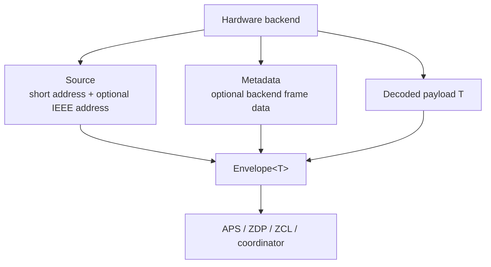

# apis-saltans-nwk Architecture

`apis-saltans-nwk` contains transport-neutral Zigbee NWK receive context types.
It is a boundary crate: hardware-facing code can attach network source and
metadata to received payloads without making protocol-facing code depend on a
specific radio or NCP backend.

The crate intentionally does not parse NWK frames, perform routing, discover
devices, or dispatch application payloads. Those responsibilities live in the
hardware, APS, ZDP, ZCL, and coordinator crates.

## Layout

The crate currently exposes its public types directly from `src/lib.rs`. The
receive-side model is small enough that separate modules would add indirection
without isolating different responsibilities.

| Public type | Responsibility |
| --- | --- | --- |
| `Envelope<T>` | Couples a payload with source and metadata context. |
| `Metadata` | Stores optional backend-provided frame metadata. |
| `Source` | Identifies the incoming NWK source by short address and optional IEEE address. |

## Data Model

`Source` is the receive-side address context. It always stores the 16-bit short
address because that address scopes several higher-layer operations, including
APS counters and coordinator routing decisions. Its IEEE address is optional
because a receiver may need a discovery/cache lookup before it can resolve the
long address.

`Metadata` is deliberately additive and optional. A backend can report link
quality, RSSI, binding table information, or source-route overhead when it has
those values. Missing metadata is represented with `None` rather than sentinel
values.

`Envelope<T>` owns the received payload and the receive-side context together.
It is generic over `T` so the same wrapper can carry raw APS data, parsed ZDP or
ZCL messages, coordinator events, or tests' synthetic payloads. The crate does
not require `T` to implement any protocol trait.

The crate deliberately has no send-side destination model. Outbound addressing
belongs to the core domain types and the higher-level crates that construct
transmissions.

## Serialization

Optional features add derive-based serialization support:

| Feature | Effect |
| --- | --- |
| `serde` | Derives `serde::Serialize` and `serde::Deserialize`. |

`Source`, `Metadata`, and `Envelope<T>` derive those implementations when the
feature is enabled.

## Dependency Boundaries

`apis-saltans-nwk` depends on `apis-saltans-core` for the shared Zigbee IEEE
address domain type:

- `IeeeAddress`

The dependency does not point back to APS, ZDP, ZCL, coordinator, or hardware
crates. This keeps NWK context reusable across layers and prevents the simple
value types from becoming coupled to a specific frame parser or runtime.
