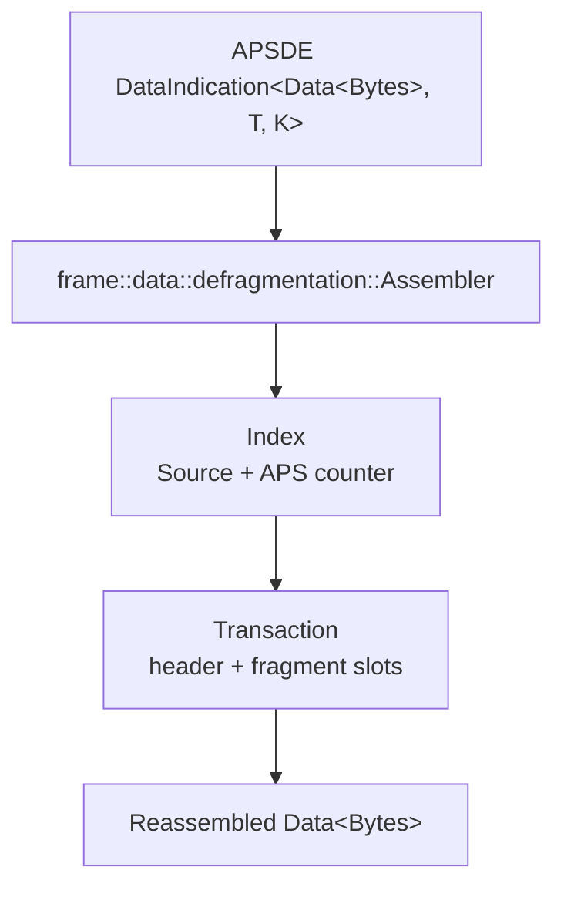
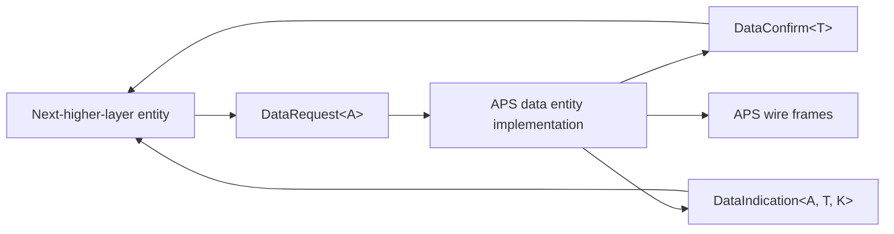

# apis-saltans-aps Architecture

`apis-saltans-aps` models Zigbee APS frames, the APS data-service boundary, and
stateful defragmentation for raw APS data payloads.

## Frame Modules

| Module                   | Responsibility                                                |
|--------------------------|---------------------------------------------------------------|
| `frame::control`         | APS frame-control bitfields and delivery mode decoding.       |
| `frame::data`            | APS data headers and payload-carrying frame types.            |
| `frame::command`         | APS command frame/header structures.                          |
| `frame::acknowledgement` | APS acknowledgement frame structures.                         |
| `frame::extended`        | Extended APS header fields, including fragmentation metadata. |
| `broadcast`              | Well-known Zigbee broadcast addresses.                        |
| `apsde`                  | APSDE request, confirmation, indication, and support types.   |

APS data headers retain cluster and profile identifiers as their raw wire values. Their
`cluster()` and `profile()` accessors provide typed `zb_core::Cluster` and `zb_core::Profile`
interpretations when the identifiers are known, while the raw accessors remain available for
unknown or manufacturer-specific values.

## APS Data Entity

The `apsde` module models the service-access-point boundary between a Zigbee
next-higher-layer entity and the APS data entity. It contains value types only;
actors, queues, persistence, and security processing belong to implementations
using the crate.

Primitive-specific destination and source enums replace a loose address mode
plus optional fields. Each enum exposes only the modes legal in its context.
Group requests include their required NWK broadcast selector.
Network broadcasts retain their receiver-set address and endpoint explicitly.
Received NWK broadcasts likewise retain their broadcast receiver set and endpoint, allowing
higher layers to distinguish broadcast requests from unicast requests addressed to the local
device.
`IndividualEndpoint` excludes the APS broadcast endpoint, while request and
confirmation destinations use `zb_core::Endpoint` where the specification
permits it.
`NetworkDestination` is the narrower address-and-endpoint pair used by APIs
that require an individually addressed NWK peer.

`DataIndication::map_context` allows a consumer to normalize the implementation-defined timestamp
and link-key device-pair handle without rebuilding or discarding the remaining indication
metadata.

ASDU length is derived from byte-like payloads, preventing disagreement
between an explicit length and the ASDU. Generic parameters preserve
implementation-defined timestamp and link-key device-pair handle
representations. Propagated NWK and security-processing status values remain
raw 8-bit codes so unknown statuses are not discarded.

`Security<K>` encodes conditional fields as variants, ensuring a key index and
key-pair handle exist only for link-key-secured ASDUs.

## Defragmentation

`frame::data::defragmentation::Assembler` owns a map of in-progress
transactions. Each
transaction is keyed by:

- `apsde::Source`, because APS counters are source-scoped;
- APS frame counter, because fragments of one APS frame share the counter.

The first fragment stores the original APS data header and opens the payload
slot vector. Follow-up fragments are inserted by block number. When every slot
is filled, the transaction concatenates all payload fragments, drops the
extended header from the saved data header, and returns a rebuilt
`Data<bytes::Bytes>`.

Invalid fragmentation states are intentionally drop-only:

- a frame marked as both first and follow-up fragment is rejected;
- fragmented frames without a block number are rejected;
- first fragments with total block count `0` are rejected;
- follow-up fragments without an existing transaction are rejected;
- out-of-bounds follow-up fragments drop the transaction.

## Primitive Enum Conversions

Fieldless enums with an integer `#[repr]`, such as APS broadcast addresses, frame types, and
delivery modes, derive `num_enum::IntoPrimitive` and `num_enum::TryFromPrimitive`. Repr enums with
payload-carrying variants cannot use these derives and retain their representation-specific parsing.
