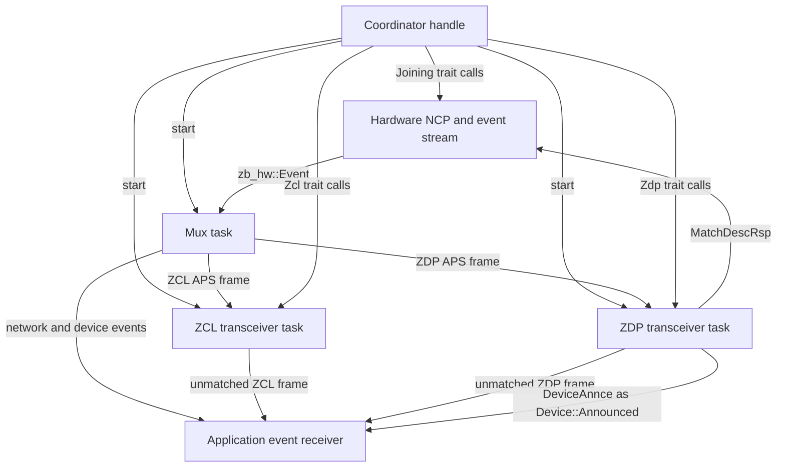
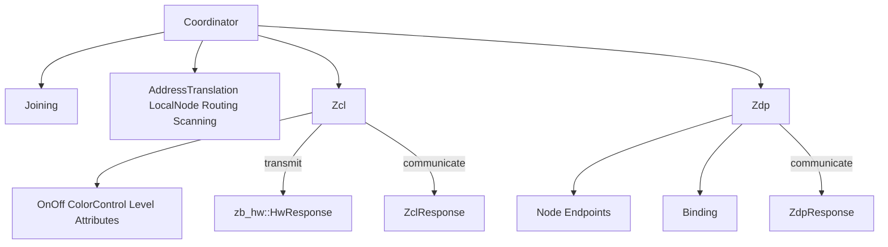
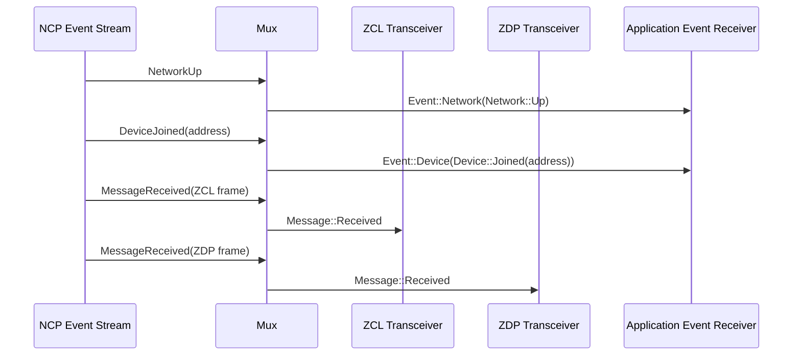
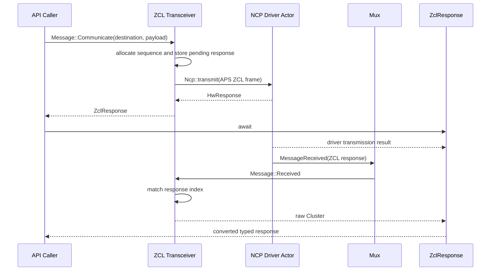
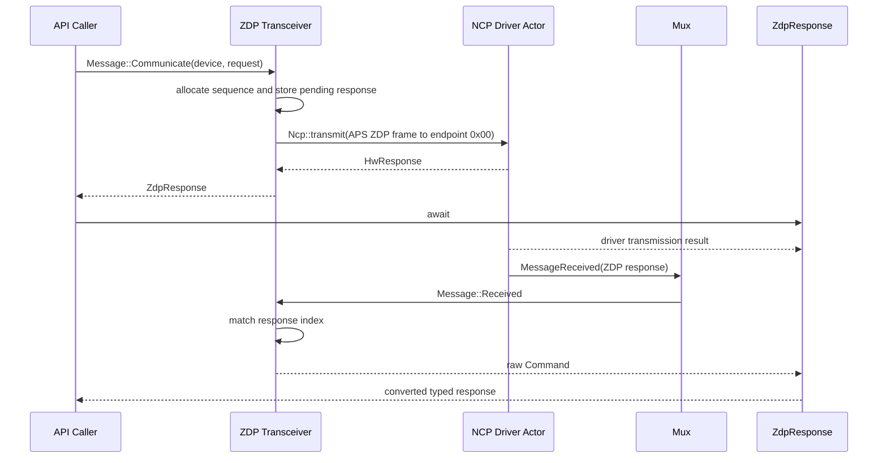
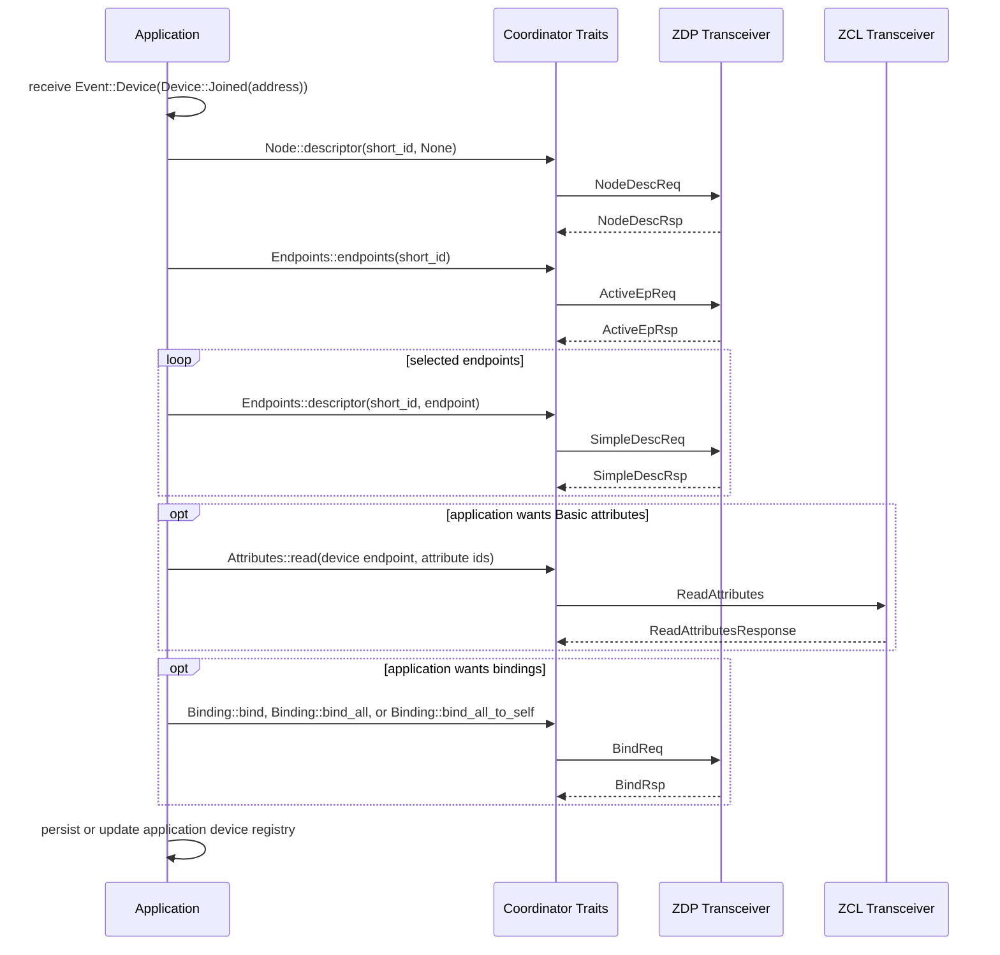
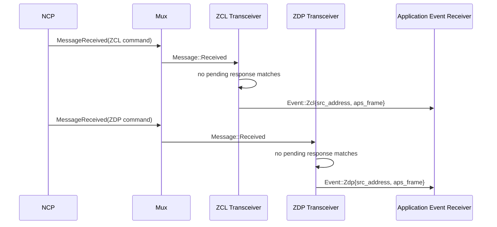

# apis-saltans-coordinator Architecture

This document explains the current coordinator internals:

- actor responsibilities
- channel topology
- request/response correlation
- how user-owned discovery and binding workflows compose the public traits

The coordinator is now a transport and protocol helper layer. It no longer contains an internal
network manager, discovery supervisor, attribute discovery pipeline, binding actor, or persistent
device model.

## Overview

`apis-saltans-coordinator` runs a small actor graph on top of `tokio`:

- the hardware driver is owned by `apis-saltans-hw`
- `Coordinator::start(...)` spawns ZCL and ZDP transceivers
- a mux task consumes hardware events and forwards APS payloads to the right transceiver
- response futures separate actor handoff from hardware transmission and protocol reception
- unmatched inbound frames and network/device notifications are sent to an application-provided
  `Sender<Event>`

Applications own higher-level policy:

- device registries
- IEEE-to-short-address resolution
- discovery retries
- endpoint filtering
- binding selection
- persistence

## Actor Topology



## Startup and Wiring

`Coordinator::start(...)`:

1. Receives an `NcpHandle`, a hardware event receiver, an outbound `Sender<Event>`, and the local
   `SimpleDescriptor` list.
2. Starts the ZCL transceiver task with a clone of the NCP handle and outbound event sender.
3. Starts the ZDP transceiver task with a clone of the NCP handle, outbound event sender, and local
   endpoint descriptors.
4. Starts the mux task with the hardware event receiver and both transceiver senders.
5. Returns a lightweight `Coordinator` holding the NCP handle plus ZCL and ZDP actor senders.

Actor inboxes are bounded MPSC channels sized by `ZIGBEE_COORDINATOR_MPSC_CHANNEL_SIZE`.

## Actor Responsibilities

### Coordinator

`Coordinator` is an API facade. It stores:

- `ncp: NcpHandle`
- `zcl: Sender<zcl::Message>`
- `zdp: Sender<zdp::Message>`

It implements:

- `Joining` directly through the hardware NCP
- `AddressTranslation`, `LocalNode`, `Routing`, and `Scanning` directly through the hardware NCP
- `Zcl` by forwarding to the ZCL transceiver sender
- `Zdp` by forwarding to the ZDP transceiver sender

The composed traits are blanket implementations:

- `Node` and `Endpoints` are implemented for any `T: Zdp + Sync`
- `Binding` is implemented for any `T: Zdp + Sync`
- `OnOff`, `ColorControl`, `Level`, and `Attributes` are implemented over `Zcl`

This means users can also implement `Zcl` or `Zdp` for their own handles, test doubles, routing
layers, or policy wrappers and still reuse the higher-level traits.

### Mux

The mux consumes `zb_hw::Event` values.

It forwards:

- `NetworkUp`, `NetworkDown`, `NetworkOpened`, `NetworkClosed`, and route errors as
  `Event::Network(...)`
- `DeviceJoined`, `DeviceRejoined`, and `DeviceLeft` as `Event::Device(...)`
- received ZCL APS frames to the ZCL transceiver
- received ZDP APS frames to the ZDP transceiver

Fragmented APS payloads are reassembled with `zb_aps::Assembler` before parsing.

### ZCL Transceiver

The ZCL transceiver:

- sends ZCL commands through the NCP
- returns the NCP's `HwResponse` without waiting for the hardware result
- creates ZCL frames with monotonically wrapping sequence numbers
- stores pending response channels for `communicate(...)`
- resolves received frames against the pending response map
- publishes unmatched inbound ZCL frames as `Event::Zcl`

Correlation uses an internal `Index` derived from destination/source information, ZCL sequence,
APS metadata, and manufacturer code.

### ZDP Transceiver

The ZDP transceiver:

- sends ZDP unicast requests to endpoint `0x00`
- composes the NCP's `HwResponse` with the correlated protocol response
- creates ZDP frames with monotonically wrapping sequence numbers
- stores pending response channels for `communicate(...)`
- resolves received frames against the pending response map
- publishes unmatched inbound ZDP frames as `Event::Zdp`

It also handles two ZDP requests locally:

- `MatchDescReq`: responds from the local `SimpleDescriptor` list provided at startup
- `DeviceAnnce`: publishes `Event::Device(Device::Announced(...))`

## Public Trait Composition

The public API is intentionally layered.



This layering keeps policy outside the crate. A user-owned discovery workflow can listen for
`Device::Joined` or `Device::Announced`, call `Node::descriptor`, call `Endpoints::endpoints`, call
`Endpoints::descriptors`, optionally read attributes through `Attributes`, and then decide whether
to call `Binding::bind`, `Binding::bind_all`, or `Binding::bind_all_to_self`.

## Key Message Flows

## 1) Incoming hardware event routing



## 2) ZCL command without a protocol response

```mermaid
sequenceDiagram
    participant API as API Caller
    participant ZCL as ZCL Transceiver
    participant HW as NCP Driver Actor
    participant R as HwResponse

    API->>ZCL: Message::Transmit(destination, payload)
    ZCL->>HW: Ncp::transmit(datagram)
    HW-->>ZCL: HwResponse
    ZCL-->>API: HwResponse
    API->>R: await
    R-->>API: Result&lt;(), zb_hw::Error&gt;
```

The first await on `Zcl::transmit(...)` covers the API-to-transceiver handoff and returns the
`HwResponse`. The second await observes the deferred driver result. The response hides the driver's
concrete completion mechanism. Dropping it stops driving and observing its inner future; whether
that cancels the hardware operation is backend-dependent.

## 3) ZCL command with response



`ZclResponse<T>` is a protocol alias for `CommunicationResponse<Cluster, T>`. Its poll order is
strict: it completes hardware transmission first, then receives the correlated raw `Cluster`, then
applies `TryFrom<Cluster>` to produce `T`. A failed transmission prevents the response receiver from
being polled.

## 4) ZDP request with response



`ZdpResponse<T>` applies the same sequencing to `CommunicationResponse<Command, T>`.

## 5) User-owned discovery workflow



## 6) Unmatched inbound frame publication



## Response Lifetimes and Timeouts

The response futures do not apply an internal deadline. This keeps timeout and retry policy with the
application, alongside its discovery and binding policy. Callers can wrap the second await in
`tokio::time::timeout`; `Error` supports conversion from Tokio's elapsed-time error.

Coordinator and APS parsing errors derive `thiserror::Error`. Hardware, receive, timeout, and nested
frame failures use source-preserving `#[from]` conversions. Channel send errors and raw ZCL/ZDP
status results retain explicit conversions because their public variants deliberately do not store
an error source compatible with `#[from]`.

`HwResponse` owns the driver's opaque deferred hardware future. `CommunicationResponse` wraps
`InternalCommunicationResponse`, which owns an `HwResponse` and the correlated ZCL or ZDP one-shot
receiver. The internal communication future always polls the hardware response first. After it
succeeds, the completed `HwResponse` is discarded and only the protocol receiver is polled; a
hardware error completes the communication future without polling that receiver.

## Removed Internal Responsibilities

The crate no longer has built-in:

- persistent network state
- address resolution APIs
- event subscription management
- automatic descriptor discovery
- automatic Basic-cluster attribute discovery
- automatic binding of output clusters
- discovery or binding retry policy

Those responsibilities now belong to the library user. The crate provides the transport actors,
typed request/response helpers, event stream, and reusable traits needed to build those workflows.
