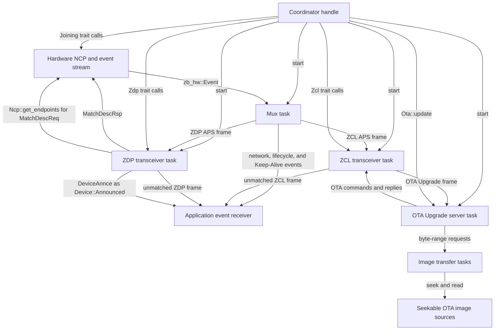
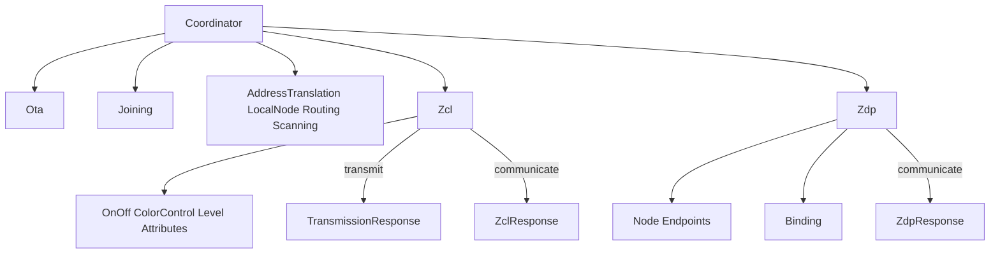
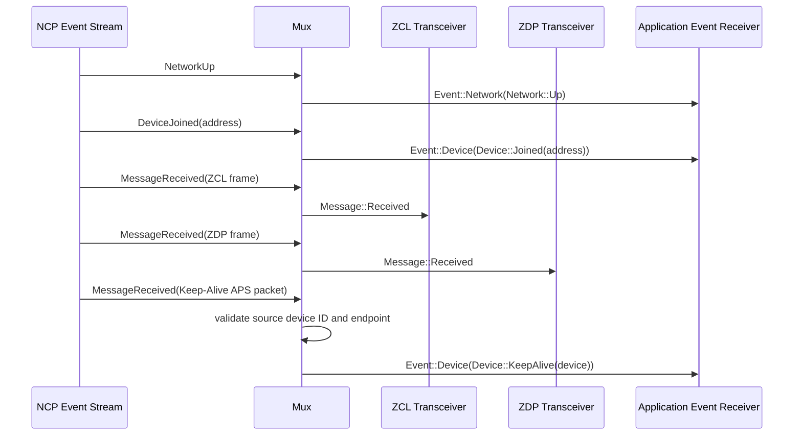
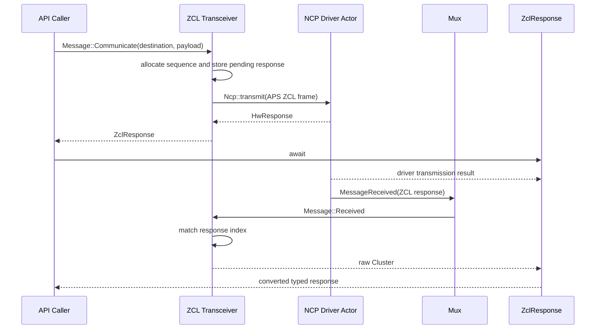
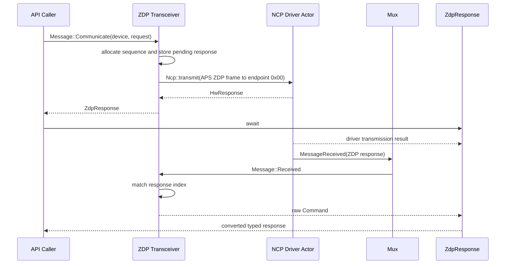
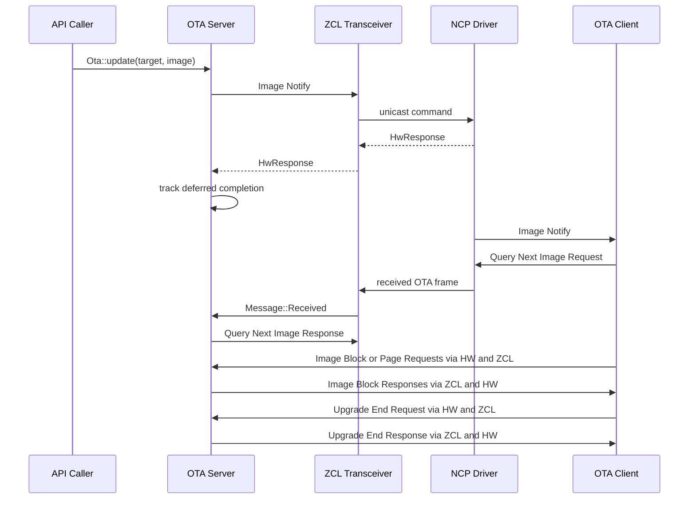
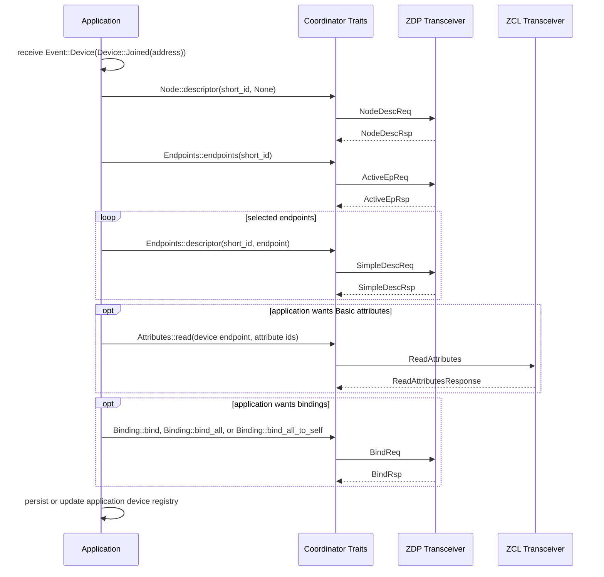
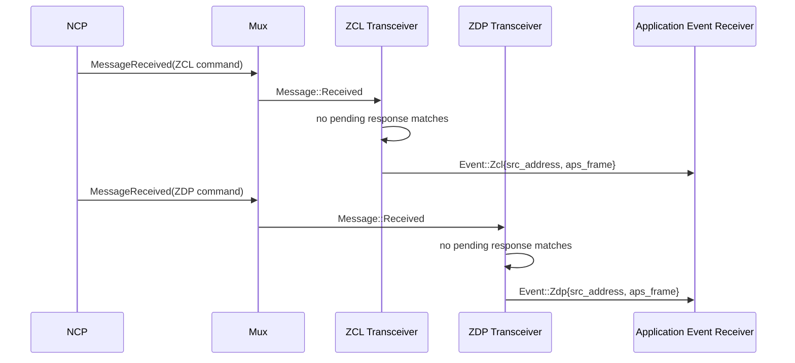

# apis-saltans-coordinator Architecture

This document explains the current coordinator internals:

- actor responsibilities
- channel topology
- request/response correlation
- how user-owned discovery and binding workflows compose the public traits

The coordinator is now a transport and protocol helper layer. It no longer contains an internal
network manager, discovery supervisor, attribute discovery pipeline, binding actor, or persistent
device model.

## Overview

`apis-saltans-coordinator` runs a small actor graph on top of `tokio`:

- the hardware driver is owned by `apis-saltans-hw`
- `Coordinator::start(...)` spawns ZCL and ZDP transceivers plus the OTA Upgrade server
- a mux task consumes hardware events and forwards APS payloads to the right transceiver
- response futures separate actor handoff from hardware transmission and protocol reception
- unmatched inbound frames and network/device notifications are sent to an application-provided
  `Sender<Event>`

Applications own higher-level policy:

- device registries
- IEEE-to-short-address resolution
- discovery retries
- endpoint filtering
- binding selection
- persistence

## Actor Topology



## Startup and Wiring

`Coordinator::start(...)`:

1. Receives an `NcpHandle`, the coordinator node descriptor, a hardware event receiver, and an
   outbound `Sender<Event>`.
2. Creates the OTA inbound channel and starts the ZCL transceiver with its sender, a clone of the
   NCP handle, and the outbound event sender.
3. Starts the OTA Upgrade server with its inbound receiver and the ZCL sender.
4. Starts the ZDP transceiver task with a clone of the NCP handle and outbound event sender.
5. Starts the mux task with the hardware event receiver and both transceiver senders.
6. Returns a lightweight `Coordinator` holding the NCP handle plus OTA, ZCL, and ZDP actor senders.

Actor inboxes are bounded MPSC channels sized by `ZIGBEE_COORDINATOR_MPSC_CHANNEL_SIZE`.

The coordinator does not own a startup copy of the local endpoints. The NCP driver is required to
provide `Box<[zb_zdp::SimpleDescriptor]>` through `Driver::get_endpoints`; the coordinator reaches
the same data through `Ncp::get_endpoints` whenever current endpoint metadata is needed.

## Actor Responsibilities

### Coordinator

`Coordinator` is an API facade. It stores:

- `ncp: NcpHandle`
- `ota: Sender<ota::Message>`
- `zcl: Sender<zcl::Message>`
- `zdp: Sender<zdp::Message>`

It implements:

- `Joining` directly through the hardware NCP
- `AddressTranslation`, `LocalNode`, `Routing`, and `Scanning` directly through the hardware NCP
- `Zcl` by forwarding to the ZCL transceiver sender
- `Zdp` by forwarding to the ZDP transceiver sender
- `Ota` by forwarding validated images and targets to the OTA server sender

The composed traits are blanket implementations:

- `Node` and `Endpoints` are implemented for any `T: Zdp + Sync`
- `Binding` is implemented for any `T: Zdp + Sync`
- `OnOff`, `ColorControl`, `Level`, and `Attributes` are implemented over `Zcl`

This means users can also implement `Zcl` or `Zdp` for their own handles, test doubles, routing
layers, or policy wrappers and still reuse the higher-level traits.

### Mux

The mux consumes `zb_hw::Event` values.

It forwards:

- `NetworkUp`, `NetworkDown`, `NetworkOpened`, `NetworkClosed`, and route errors as
  `Event::Network(...)`
- `DeviceJoined`, `DeviceRejoined`, and `DeviceLeft` as `Event::Device(...)`
- Keep-Alive APS packets as `Event::Device(Device::KeepAlive(...))`
- received ZCL APS frames to the ZCL transceiver
- received ZDP APS frames to the ZDP transceiver

Fragmented APS payloads are reassembled with `zb_aps::Assembler` before parsing.

APS payload classification first resolves the profile. Network-profile frames are parsed as ZDP.
For supported application profiles, cluster ID `0x0025` is classified as Keep-Alive without parsing
the payload as a ZCL frame; other cluster IDs continue through ZCL parsing. The Keep-Alive event
stores the source NWK device ID and APS source endpoint in a `zb_core::destination::Device`. A
source outside the allocated device-ID range or a reserved source endpoint is logged and dropped.

### ZCL Transceiver

The ZCL transceiver:

- sends ZCL commands through the NCP
- returns the NCP's `HwResponse` without waiting for the hardware result
- creates ZCL frames with monotonically wrapping sequence numbers
- stores pending response channels for `communicate(...)`
- resolves received frames against the pending response map
- forwards unmatched OTA Upgrade frames to the OTA server
- sends OTA replies with an explicit request sequence number and page responses with advancing
  sequence numbers
- publishes unmatched inbound ZCL frames as `Event::Zcl`

Correlation uses an internal `Index` derived from destination/source information, ZCL sequence,
APS metadata, and manufacturer code.

### OTA Upgrade Server

The OTA server owns the policy and state required by cluster `0x0019`. Its inbox accepts either an
`Update` containing a target endpoint, application profile, validated image, and completion
one-shot, or a `Received` message containing NWK source information and a typed APS/ZCL OTA command.
One scheduled image is stored per device endpoint; a later update replaces it and resolves the old
completion channel as superseded.

The OTA module keeps the actor and protocol handlers in `ota.rs`. Its supporting types are grouped
by responsibility: `message.rs` defines the public actor messages, target, and update result;
`state.rs` contains scheduled-update and request context state; `transfer.rs` defines internal
completion events and generation keys; and `page_transfer.rs` owns the paced page-transfer worker.
Image parsing and source access remain under the nested `image` module.

An image separates its parsed header from its payload source. The small serialized header and its
decoded metadata remain in memory, while the payload stays behind an owned `Read + Seek` handle.
The `ParseImage` extension trait defines the parsing workflow as overridable default stages for
initial positioning, fixed-header reading, optional-header reading, length discovery, and final
payload positioning. The standard implementation attaches this workflow to `std::fs::File`.
Scheduling an image moves that handle into a dedicated image-transfer task. Page transfers and
ordinary block requests use cloneable channel handles to request byte ranges, and the task
serializes access to its file cursor. OTA clients can therefore request arbitrary or previous file
offsets without loading the full image or sharing the reader behind a mutex. The transfer task runs
asynchronously and delegates each synchronous seek/read operation to Tokio's blocking pool, so it
does not permanently occupy a blocking thread or stall an actor worker.

Every OTA `Transmit` and `Reply` message includes a one-shot response channel. The ZCL transceiver
uses that channel to return the driver's deferred `HwResponse` without polling it. The OTA actor
owns those responses and polls them in tracked tasks, reaping completed tasks while continuing to
service its inbound channel. A page-transfer task polls each block's response itself and stops the
remaining page stream after a hardware failure. Background tasks report terminal failures to the
actor over an internal channel. Generation identifiers prevent a late result from an older page
task from completing a newer update for the same endpoint and image ID.

On `Update`, the server sends a unicast Image Notify. It then handles Query Next Image, Query
Specific File, Image Block, Image Page, and Upgrade End commands without application involvement.
It checks image identity, optional IEEE destination and hardware constraints, file bounds, and the
incoming profile before replying. Page requests run in their own task so response spacing does not
block other OTA clients. Their Image Block responses have increasing ZCL sequence numbers and APS
acknowledgement disabled; ordinary replies preserve the request sequence and retain APS retries.
The client's Upgrade End status resolves the completion one-shot, which in turn resolves the
future returned by `Ota::update`.

### ZDP Transceiver

The ZDP transceiver:

- sends ZDP unicast requests to endpoint `0x00`
- composes the NCP's `HwResponse` with the correlated protocol response
- queries `Ncp::get_endpoints` when serving an incoming `MatchDescReq`
- creates ZDP frames with monotonically wrapping sequence numbers
- stores pending response channels for `communicate(...)`
- resolves received frames against the pending response map
- publishes unmatched inbound ZDP frames as `Event::Zdp`

It also handles two ZDP requests locally:

- `MatchDescReq`: fetches the NCP's current `SimpleDescriptor` values and responds with the matching
  endpoint IDs; if the endpoint query fails, no response can be produced
- `DeviceAnnce`: publishes `Event::Device(Device::Announced(...))`

## Public Trait Composition

The public API is intentionally layered.



This layering keeps policy outside the crate. A user-owned discovery workflow can listen for
`Device::Joined` or `Device::Announced`, call `Node::descriptor`, call `Endpoints::endpoints`, call
`Endpoints::descriptors`, optionally read attributes through `Attributes`, and then decide whether
to call `Binding::bind`, `Binding::bind_all`, or `Binding::bind_all_to_self`.

## Key Message Flows

## 1) Incoming hardware event routing



## 2) ZCL command without a protocol response

```mermaid
sequenceDiagram
    participant API as API Caller
    participant ZCL as ZCL Transceiver
    participant HW as NCP Driver Actor
    participant R as TransmissionResponse

    API->>ZCL: Message::Transmit(destination, payload)
    ZCL->>HW: Ncp::transmit(datagram)
    HW-->>ZCL: HwResponse
    ZCL->>ZCL: wrap HwResponse
    ZCL-->>API: TransmissionResponse
    API->>R: await
    R-->>API: Result&lt;(), Error&gt;
```

The first await on `Zcl::transmit(...)` covers the API-to-transceiver handoff and returns the
`TransmissionResponse`. It wraps the driver's `HwResponse`, and the second await observes the
deferred driver result while converting `zb_hw::Error` into the coordinator's `Error`. The wrapper
hides the driver's concrete completion mechanism. Dropping it stops driving and observing its inner
future; whether that cancels the hardware operation is backend-dependent.

## 3) ZCL command with response



`ZclResponse<T>` is a protocol alias for `CommunicationResponse<Cluster, T>`. Its poll order is
strict: it completes hardware transmission first, then receives the correlated raw `Cluster`, then
applies `TryFrom<Cluster>` to produce `T`. A failed transmission prevents the response receiver from
being polled.

## 4) ZDP request with response



`ZdpResponse<T>` applies the same sequencing to `CommunicationResponse<Command, T>`.

## 5) Automatic OTA image transfer



The diagram abbreviates inbound routing through the mux. The OTA actor receives already parsed
`Data<Frame<ota_upgrade::Command>>` values from the ZCL transceiver. Non-successful upgrade-end
statuses receive a successful global Default Response, while malformed, unavailable, and
unauthorized transfer requests receive the ZCL-defined error status.

## 6) User-owned discovery workflow



## 7) Unmatched inbound frame publication



## Response Lifetimes and Timeouts

The response futures do not apply an internal deadline. This keeps timeout and retry policy with the
application, alongside its discovery and binding policy. Callers can wrap the second await in
`tokio::time::timeout`; `Error` supports conversion from Tokio's elapsed-time error.

Coordinator and APS parsing errors derive `thiserror::Error`. Hardware, receive, timeout, and nested
frame failures use source-preserving `#[from]` conversions. Channel send errors and raw ZCL/ZDP
status results retain explicit conversions because their public variants deliberately do not store
an error source compatible with `#[from]`.

`HwResponse` owns the driver's opaque deferred hardware future. `TransmissionResponse` wraps it for
commands without a protocol response and converts its error into the coordinator's `Error`.
`CommunicationResponse` wraps `InternalCommunicationResponse`, which owns an `HwResponse` and the
correlated ZCL or ZDP one-shot receiver. The internal communication future always polls the hardware
response first. After it succeeds, the completed `HwResponse` is discarded and only the protocol
receiver is polled; a hardware error completes the communication future without polling that
receiver.

## Removed Internal Responsibilities

The crate no longer has built-in:

- persistent network state
- address resolution APIs
- event subscription management
- automatic descriptor discovery
- automatic Basic-cluster attribute discovery
- automatic binding of output clusters
- discovery or binding retry policy

Those responsibilities now belong to the library user. The crate provides the transport actors,
typed request/response helpers, event stream, and reusable traits needed to build those workflows.
