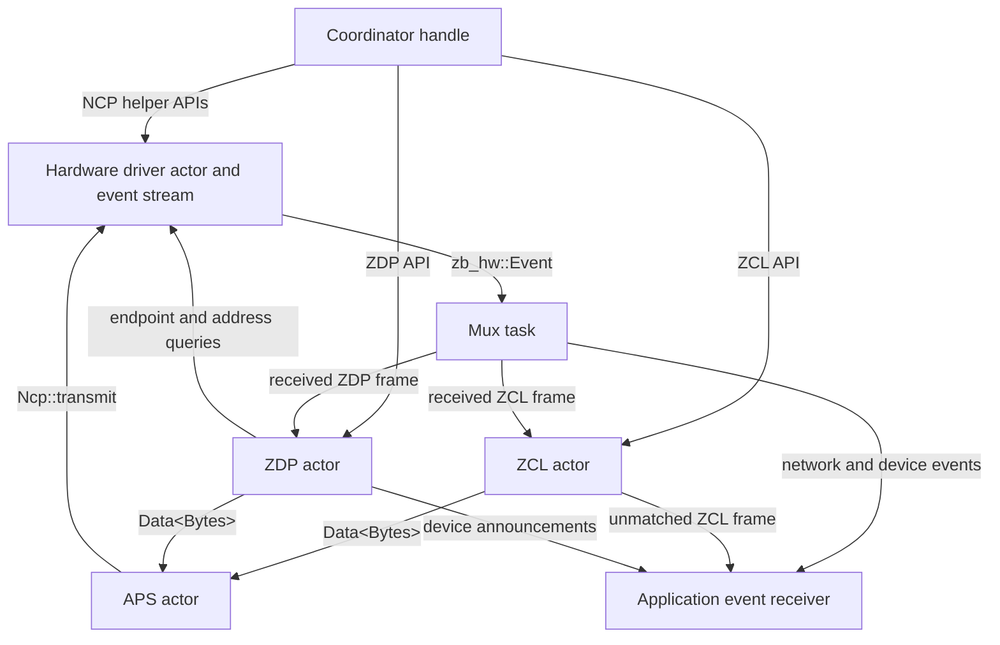
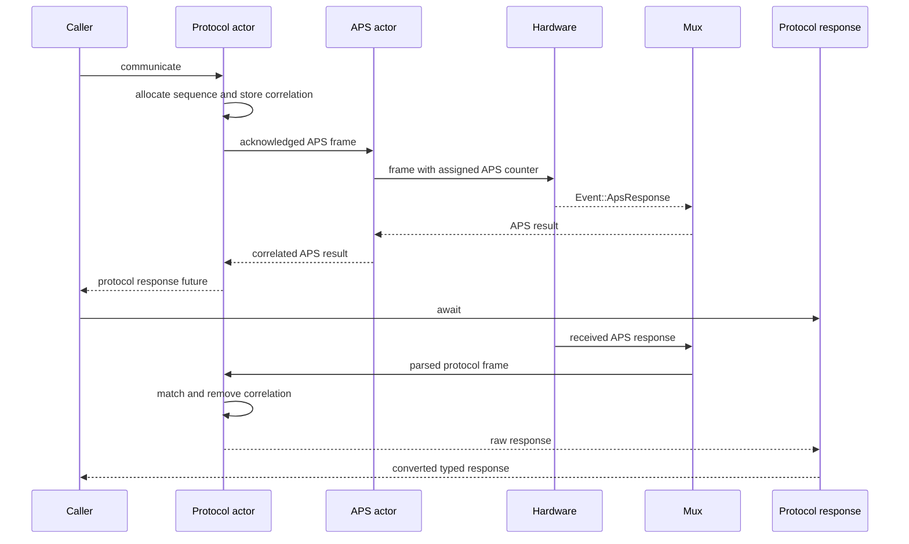
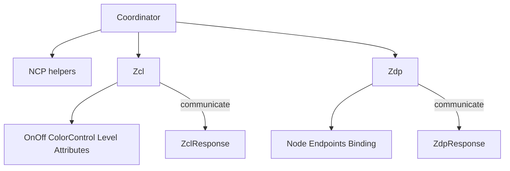

# apis-saltans-coordinator Architecture

The coordinator is a transport and protocol-helper layer built around bounded Tokio actors.
Applications own device registries, discovery policy, retries, binding selection, and persistence.

## Actor Topology



`Coordinator::start` creates the APS, ZCL, and ZDP actors plus the event mux. Actor inboxes use
`ZIGBEE_COORDINATOR_MPSC_CHANNEL_SIZE`.

## APS Actor

The APS actor is the only coordinator actor that transmits directly through `zb_hw::Ncp`. It owns a
wrapping `u8` APS frame counter. For every outgoing message it:

1. consumes the supplied `zb_aps::Data<bytes::Bytes>` frame
2. replaces the frame header counter with its next counter value
3. stores acknowledged callers under that counter
4. forwards the frame and destination to the hardware actor

Its command protocol contains:

```text
Transmit {
    destination: zb_core::Destination,
    frame: zb_aps::Data<bytes::Bytes>,
    response: Option<oneshot::Sender<Result<(), zb_hw::Error>>>,
}
```

The APS sender helper examines the frame's ACK-request control bit. That bit is set while building
the frame when `TxOptions::ACKNOWLEDGED_TRANSMISSION` is present.

- Acknowledged frame: retain the caller's response sender and await the matching hardware
  `Event::ApsResponse`.
- Unacknowledged frame: omit the caller response and return after actor handoff.

```mermaid
sequenceDiagram
    participant P as ZCL or ZDP actor
    participant A as APS actor
    participant H as Hardware actor
    participant M as Event mux

    P->>P: build Data&lt;Bytes&gt; with TxOptions
    P->>A: Transmit destination, frame
    A->>A: assign next APS counter
    A->>H: transmit destination, frame
    opt acknowledged transmission
        H-->>M: Event::ApsResponse
        M-->>A: ApsResponse
        A-->>P: completed APS result
    end
```

## ZCL Actor

The ZCL actor:

- owns the wrapping ZCL transaction sequence
- serializes typed commands into ZCL frames
- builds APS data headers from profile, cluster, endpoint, destination, and `TxOptions`
- sends complete APS frames through the APS actor
- stores response correlation channels for `communicate`
- routes unmatched received commands to the application event channel

For `transmit`, the actor returns only after the APS helper completes. For `communicate`, it inserts
the correlation entry before transmitting, removes it if transmission fails, and returns a
protocol-only response receiver after successful APS completion.

## ZDP Actor

The ZDP actor:

- owns the wrapping ZDP transaction sequence
- uses profile `0x0000` and endpoint `0x00`
- sends complete APS frames through the APS actor
- correlates request and response commands
- queries the NCP directly for endpoint and address information needed while serving ZDP requests
- handles device announcements and selected incoming requests

ZDP responses generated locally also travel through the APS actor, so their APS counters and
acknowledgement behavior follow the same path as outgoing requests.

## Response Correlation

Pending ZCL and ZDP requests are keyed by an internal `Index` containing:

- remote short address
- endpoint
- cluster ID
- profile ID
- optional ZCL manufacturer code
- protocol transaction sequence

The mux parses received APS frames and forwards them to the appropriate protocol actor. Each actor
reconstructs the index from the received frame and removes the matching one-shot sender.



`CommunicationResponse<Raw, T>` no longer contains a hardware future. APS completion occurs before
the response object is returned; the response future only awaits the correlated command and applies
`TryFrom`.

## Mux and Events

The mux consumes `zb_hw::Event` values. It forwards network and device lifecycle events to the
application, reassembles fragmented APS payloads, parses network-profile frames as ZDP, parses
supported application-profile frames as ZCL, and recognizes Keep-Alive traffic before ZCL parsing.

Unmatched ZCL commands and supported device notifications remain application-visible. The
coordinator does not maintain a persistent device table.

## Public Trait Composition



Command helpers that do not expect a protocol response return `Result<(), Error>` directly.
Communication methods first await APS completion and then return `ZclResponse<T>` or
`ZdpResponse<T>` for the application-level response.
