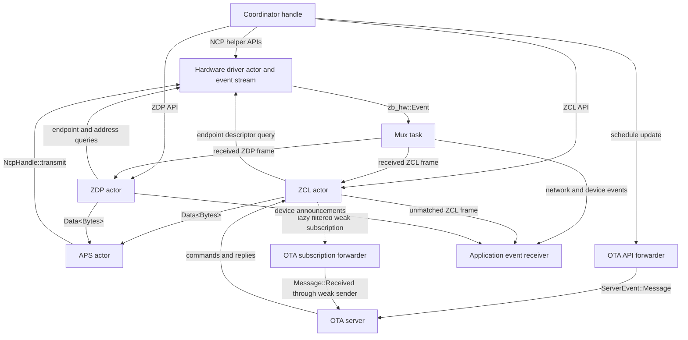
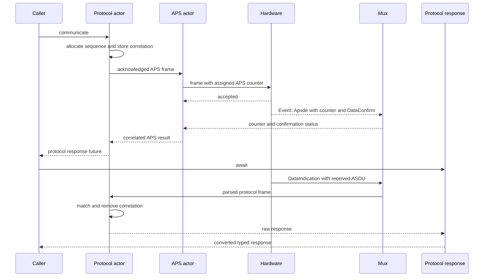
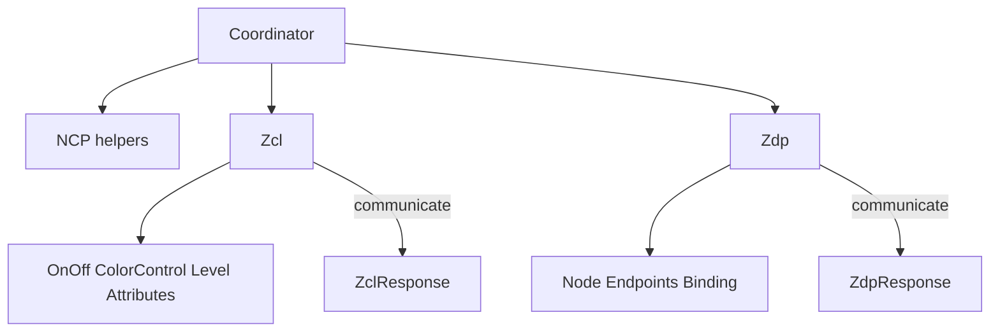

# apis-saltans-coordinator Architecture

The coordinator is a transport and protocol-helper layer built around bounded Tokio actors.
Applications own device registries, discovery policy, retries, binding selection, and persistence.

## Actor Topology


```mermaid
flowchart TD
    HW[Hardware driver actor and event stream]
    C[Coordinator handle]
    APS[APS actor]
    ZCL[ZCL actor]
    ZDP[ZDP actor]
    OTA[OTA server]
    OTAA[OTA API forwarder]
    OTAS[OTA subscription forwarder]
    M[Mux task]
    APP[Application event receiver]

    C -->|ZCL API| ZCL
    C -->|ZDP API| ZDP
    C -->|schedule update| OTAA
    OTAA -->|ServerEvent::Message| OTA
    C -->|NCP helper APIs| HW
    ZCL -->|Data&lt;Bytes&gt;| APS
    ZDP -->|Data&lt;Bytes&gt;| APS
    ZCL -->|endpoint descriptor query| HW
    ZDP -->|endpoint and address queries| HW
    APS -->|NcpHandle::transmit| HW
    HW -->|zb_hw::Event| M
    M -->|received ZCL frame| ZCL
    M -->|received ZDP frame| ZDP
    M -->|network and device events| APP
    ZCL -->|unmatched ZCL frame| APP
    ZCL -.->|lazy filtered weak subscription| OTAS
    OTAS -->|Message::Received through weak sender| OTA
    OTA -->|commands and replies| ZCL
    ZDP -->|device announcements| APP
```

`Coordinator::start` creates the APS, ZCL, ZDP, and OTA actors plus the event mux. Actor inboxes
use `ZIGBEE_COORDINATOR_MPSC_CHANNEL_SIZE`.

ZDP commands enter their actor as complete `DataRequest<Bytes>` values because their local source
endpoint is always the ZDO data endpoint. ZCL commands enter their actor as complete
`DataRequest<UnsequencedFrame<Bytes>>` values; the actor assigns the ZCL transaction sequence,
serializes the resulting regular frame, and preserves all APS fields.

## APS Actor

The APS transceiver stores a concrete `zb_hw::NcpHandle`; it is the only coordinator actor that
transmits directly through that handle. It also owns the wrapping eight-bit Zigbee APS counter
allocator.
For every outgoing message it:

1. consumes the supplied `zb_aps::apsde::DataRequest<bytes::Bytes>`
2. assigns a counter that is neither pending nor quarantined
3. forwards the request and counter to the hardware actor
4. resolves an unacknowledged caller after hardware acceptance, or stores an acknowledged caller
   under the counter
5. quarantines counters released by dropped callers, missing-confirmation timeouts, or network
   loss until the corresponding late confirmation arrives

Its command protocol contains:

```text
Transmit {
    request: zb_aps::apsde::DataRequest<bytes::Bytes>,
    response: oneshot::Sender<Result<TransmissionResponse, crate::Error>>,
}
Confirm { counter, status }
Cancel { counter }
ConfirmationTimeout { counter }
NetworkDown
```

The `Aps` handle wraps the APS actor's `Sender<Message>`. Its inherent `transmit` method queues the
actor message and returns a deferred `TransmissionResponse`. It creates a completion channel for
every transmission. The APS actor resolves that channel when the hardware rejects or accepts an
unacknowledged request. When its options contain `TxOptions::ACKNOWLEDGED_TRANSMISSION` and its
destination is an individual network or extended address, hardware acceptance instead stores the
sender until the APS result arrives. Group and broadcast transmissions never await APS
acknowledgements. Its completion method forwards hardware APSDE confirmations from the mux.
The actor reads exactly one bounded message inbox. Cancellation and confirmation-timeout events use
that same inbox; timeout tasks hold a weak sender, sleep, and enqueue `ConfirmationTimeout`.
Cancellation and timeout messages carry a coordinator-private allocation generation in addition to
the counter. That generation never crosses the hardware boundary and prevents an old lifecycle
message from removing a newer transmission after successful counter reuse.

- Acknowledged unicast frame: retain the caller's response sender under the APS counter and await
  `ApsdeEvent::DataConfirm`.
- Unacknowledged, group, or broadcast frame: resolve the caller response after backend acceptance.

The allocator scans all 256 counter values and never reuses one while it is pending or quarantined.
Cancellation, confirmation timeout, and network loss quarantine an accepted acknowledged
transmission's counter until a late confirmation for that counter arrives. The quarantine has no
clock-based expiry, because the hardware API makes no promise about maximum confirmation latency.
When every counter is unavailable, the actor returns `Error::ApsCounterExhausted` rather than
risking a stale confirmation completing a new transmission. Successful or failed confirmations
release their counters immediately. Unacknowledged transmissions resolve without storing their
response, and rejected transmissions never reach the pending-confirmation map.

```mermaid
sequenceDiagram
    participant P as ZCL or ZDP actor
    participant A as APS actor
    participant H as Hardware actor
    participant M as Event mux

    P->>P: serialize protocol payload
    P->>P: construct DataRequest&lt;Bytes&gt;
    P->>A: Transmit request
    A-->>P: deferred transmission response
    A->>A: assign APS counter
    A->>H: transmit request and counter
    H-->>A: accepted
    alt unacknowledged transmission
        A-->>P: resolve deferred APS result
    else acknowledged transmission
        A->>A: store response under counter
        H-->>M: Event::Apsde with counter and DataConfirm
        M-->>A: counter and confirmation status
        A-->>P: resolve deferred APS result
    end
```

## ZCL Actor

The ZCL actor:

- owns a collision-safe ZCL transaction-sequence allocator
- receives parsed ZCL frames as normalized `DataIndication<Frame<Cluster>, (), ()>` values
- accepts complete `DataRequest<UnsequencedFrame<Bytes>>` values
- consumes each unsequenced frame with the assigned transaction sequence and serializes the
  resulting `Frame<Bytes>` while preserving every APS request field
- sends the resulting `DataRequest<Bytes>` through the APS actor
- stores response correlation channels for `communicate`
- registers generic filtered subscriptions received through its actor inbox
- unregisters subscriptions by channel identity and prunes subscriptions whose receivers have closed
- correlates responses before delivering unmatched frames to generic internal subscriptions
- sends replies with an explicitly supplied ZCL transaction sequence
- routes unmatched received commands to the application event channel

For response-free `transmit` messages and replies, the actor forwards the deferred APS result to
the caller. An individual `transmit` must disable ZCL Default Responses; its sequence allocator
skips pending and quarantined identities but does not retain the selected identity. For
`communicate`, including the public `communicate_default` helper, the actor inserts the correlation
entry before transmitting and returns an `ApsProtocolResponse` containing both the deferred APS
result and protocol receiver. The actor therefore continues processing commands while
acknowledgements are pending. Awaiting the internal response completes APS transmission before
polling the correlated protocol response. Reply transmission preserves the request transaction
sequence instead of allocating a new one.

The allocator scans the complete 256-value sequence space for the request's correlation domain and
never replaces a pending entry. Successful responses release their correlation identity
immediately. Response-free transmissions do not enter protocol quarantine. The actor expires
pending protocol responses after 30 seconds. Timed-out and cancelled tracked responses remain
quarantined until a late frame arrives or a further 30-second grace period expires. Dropping an
`ApsProtocolResponse` enqueues `Cancel` through the actor's ordinary bounded inbox. Per-response
and quarantine timer tasks hold a weak sender and enqueue `ResponseTimeout` or
`QuarantineTimeout` through that same inbox. These messages carry a coordinator-private allocation
generation so a stale timer cannot remove a reused transaction. The actor has no auxiliary
receiver and processes its inbox with one `recv` loop. A network-down message fails pending
responses and begins a fresh correlation epoch.

Source-endpoint policy belongs to the caller. The ZCL actor does not query or cache local endpoint
descriptors. High-level cluster helpers therefore require an explicit `IndividualEndpoint`, while
the raw `Zcl` API accepts the complete `DataRequest`. A communicating request must use a 16-bit
network destination with one individual remote endpoint because response correlation requires both
values.

## OTA Upgrade Server

The OTA subsystem installs a ZCL subscription for cluster-specific, client-to-server OTA Upgrade
frames on demand. When the OTA actor admits its first device update, it sends the subscription
through the ZCL actor handle before spawning the destination transfer and its Image Notify
operation. The channel ordering therefore registers the subscription before the client can respond
to the offer. A lightweight forwarding task converts subscribed frames into ordinary OTA
`Message::Received` values. Concurrent updates and replacements reuse the same subscription and
forwarding task. When the last destination transfer finishes, the OTA server aborts the forwarding
task and sends an explicit unsubscribe message to ZCL. A later update batch registers a new
subscription.

ZCL applies only the subscription's typed cluster, scope, and direction filter; the OTA forwarding
task performs the typed `Cluster::OtaUpgrade` match. Response correlation includes the direction
opposite the outgoing request and runs before subscription delivery. An unrelated client request
therefore remains available to the subscription, while a matching response cannot be consumed by
it. ZCL uses non-blocking delivery for each bounded subscription channel. A full channel retains
its subscription but sends the current frame through application-event routing. A closed channel
removes the subscription immediately. Subscription setup is no longer part of coordinator startup
or constructor wiring.

The OTA server awaits one private event inbox. A small API task forwards public `Message` values
into it, subscription forwarding tasks send received frames into it, and destination supervisors
send transfer completion into it. When the public OTA channel closes, the API task queues a shutdown
event. The server therefore does not manually poll multiple receivers or its transfer tasks.

Each update carries a `FullAddress` plus its remote endpoint. The transfer pins the IEEE identity
and current NWK short address for Image Notify transmission and destination-restricted image
checks. Before the server routes any inbound OTA request, it resolves the request's NWK source
through the NCP and compares the result with the pinned IEEE address. A stale offer cannot therefore
be inherited by a different device after NWK short-address reuse. Query Specific File requests,
optional request-node addresses, and OTA image header destinations are validated against that same
identity.

The API task owns the sole strong sender for the private event inbox. Subscription and transfer
forwarders hold only weak senders. ZCL and those forwarders therefore cannot keep the OTA actor
alive. When the external OTA senders are dropped, the API task queues shutdown, the OTA actor exits,
and it aborts the subscription and active transfer tasks. This avoids a strong
ZCL-to-OTA-to-ZCL actor cycle.

Normal OTA commands and replies retain the default acknowledged APS transmission option. Image Page
block responses use empty `TxOptions`; their deferred APS result therefore completes after hardware
backend acceptance instead of waiting for an acknowledgement. The page task applies the requested
spacing and advances the ZCL transaction sequence between blocks.

## ZDP Actor

The ZDP actor:

- stores a concrete `zb_hw::NcpHandle` for NCP queries
- receives parsed ZDP frames as normalized `DataIndication<Frame<Command>, (), ()>` values
- owns a collision-safe ZDP transaction-sequence allocator
- uses profile `0x0000` and endpoint `0x00`
- sends APS metadata and serialized ZDP frames through the APS actor
- correlates request and response commands
- queries the NCP directly for endpoint and address information needed while serving ZDP requests
- handles device announcements and incoming address, descriptor, endpoint, match-descriptor,
  system-server-discovery, and permit-joining requests

For local `Active_EP_req` and `Simple_Desc_req` commands, the actor uses the NCP's current endpoint
descriptors. Single-device address requests use the NCP's address-translation operations.
Extended address requests return `NOT_SUPPORTED` because the hardware abstraction does not expose
an associated-device list. `Power_Desc_req` returns `NO_DESCRIPTOR` because the coordinator startup
configuration does not contain a power descriptor. `System_Server_Discovery_req` receives a
response only when the requested mask intersects the server mask advertised in the coordinator's
node descriptor.

ZDP responses generated locally also travel through the APS actor, so their APS counters and
acknowledgement behavior follow the same path as outgoing requests.

## Response Correlation

Pending ZCL and ZDP requests are keyed by an internal `Index` containing:

- remote short address
- endpoint
- cluster ID
- profile ID
- optional ZCL manufacturer code
- protocol transaction sequence

The mux parses successful APSDE data indications and forwards them to the appropriate protocol
actor. Each actor reconstructs the index from the received metadata and parsed frame and removes
the matching one-shot sender. Each protocol actor permits up to 256 unavailable identities within
one correlation domain. It returns `TransactionSequenceExhausted` when no sequence is available
and expires pending responses after 30 seconds. Response-free ZCL transmissions skip unavailable
identities without reserving the selected sequence. Cancelled and timed-out tracked identities
remain quarantined until a late frame arrives, the 30-second quarantine grace period expires, or
the network goes down.

APS, ZCL, and ZDP each own exactly one bounded message receiver. Hardware events, API requests,
cancellations, response and quarantine timeout notifications, and network lifecycle notifications
are serialized through that actor's single inbox.


```mermaid
sequenceDiagram
    participant API as Caller
    participant P as Protocol actor
    participant A as APS actor
    participant H as Hardware
    participant M as Mux
    participant R as Protocol response

    API->>P: communicate
    P->>P: allocate sequence and store correlation
    P->>A: acknowledged APS frame
    A->>H: frame with assigned APS counter
    H-->>A: accepted
    H-->>M: Event::Apsde with counter and DataConfirm
    M-->>A: counter and confirmation status
    A-->>P: correlated APS result
    P-->>API: protocol response future
    API->>R: await
    H->>M: DataIndication with received ASDU
    M->>P: parsed protocol frame
    P->>P: match and remove correlation
    P-->>R: raw response
    R-->>API: converted typed response
```

`CommunicationResponse<Raw, T>` contains the deferred APS completion and the correlated protocol
receiver. Polling it completes APS transmission first, then waits for the correlated command and
applies `TryFrom`.

## Mux and Events

The mux consumes generic `zb_hw::Event<T, K>` values. It forwards network and device lifecycle
events to the application, accepts successful `DataIndication<Bytes, T, K>` values, parses
network-profile ASDUs as ZDP, parses supported application-profile ASDUs as ZCL, and recognizes
Keep-Alive traffic before ZCL parsing. APS reassembly and security processing have already happened
before the hardware backend emits the indication. Before forwarding parsed indications to the
protocol actors, the mux normalizes only the backend-defined timestamp and device-key-pair handle
to `()`; APS addressing, profile, cluster, status, security mode, key index, link quality, and the
parsed ASDU remain attached.

Unmatched ZCL commands remain application-visible as normalized
`DataIndication<Frame<Cluster>, (), ()>` values, preserving the APSDE receive metadata with the
parsed ZCL frame. Supported device notifications also remain application-visible. The coordinator
does not maintain a persistent device table. Application-event delivery uses non-blocking channel
sends. A new event is dropped and logged if the application channel is full or closed, ensuring
application backpressure cannot stall the mux or protocol actors. Applications must therefore
treat events as lossy notifications rather than durable state.

## Public Trait Composition


```mermaid
flowchart TD
    C[Coordinator]
    N[NCP helpers]
    ZCL[Zcl]
    ZDP[Zdp]
    CL[OnOff ColorControl Level Attributes]
    DS[Node Endpoints Binding]
    ZCLR[ZclResponse]
    ZDPR[ZdpResponse]

    C --> N
    C --> ZCL
    C --> ZDP
    ZCL --> CL
    ZDP --> DS
    ZCL -->|communicate| ZCLR
    ZDP -->|communicate| ZDPR
```

Command helpers that do not expect a protocol response return `Result<(), Error>` after completing
the deferred APS result outside the protocol actor. Communication methods return `ZclResponse<T>`
or `ZdpResponse<T>` containing both the deferred APS completion and the application-level response.
