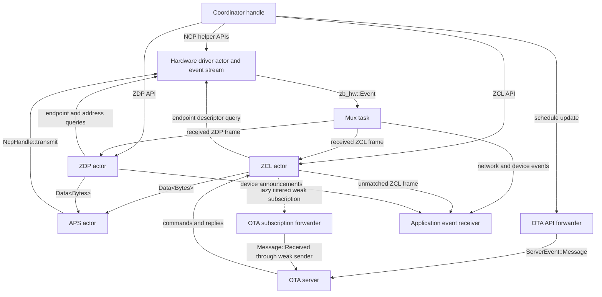
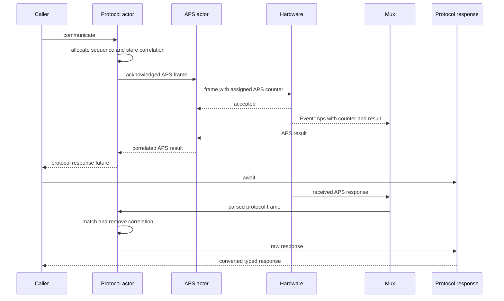
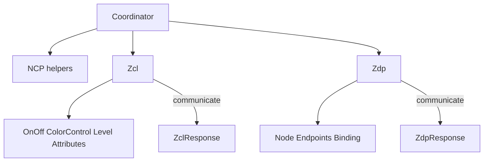

# apis-saltans-coordinator Architecture

The coordinator is a transport and protocol-helper layer built around bounded Tokio actors.
Applications own device registries, discovery policy, retries, binding selection, and persistence.

## Actor Topology


```mermaid
flowchart TD
    HW[Hardware driver actor and event stream]
    C[Coordinator handle]
    APS[APS actor]
    ZCL[ZCL actor]
    ZDP[ZDP actor]
    OTA[OTA server]
    OTAA[OTA API forwarder]
    OTAS[OTA subscription forwarder]
    M[Mux task]
    APP[Application event receiver]

    C -->|ZCL API| ZCL
    C -->|ZDP API| ZDP
    C -->|schedule update| OTAA
    OTAA -->|ServerEvent::Message| OTA
    C -->|NCP helper APIs| HW
    ZCL -->|Data&lt;Bytes&gt;| APS
    ZDP -->|Data&lt;Bytes&gt;| APS
    ZCL -->|endpoint descriptor query| HW
    ZDP -->|endpoint and address queries| HW
    APS -->|NcpHandle::transmit| HW
    HW -->|zb_hw::Event| M
    M -->|received ZCL frame| ZCL
    M -->|received ZDP frame| ZDP
    M -->|network and device events| APP
    ZCL -->|unmatched ZCL frame| APP
    ZCL -.->|lazy filtered weak subscription| OTAS
    OTAS -->|Message::Received through weak sender| OTA
    OTA -->|commands and replies| ZCL
    ZDP -->|device announcements| APP
```

`Coordinator::start` creates the APS, ZCL, ZDP, and OTA actors plus the event mux. Actor inboxes
use `ZIGBEE_COORDINATOR_MPSC_CHANNEL_SIZE`.

## APS Actor

The APS actor is the only coordinator actor that transmits directly through `zb_hw::NcpHandle`. It
owns a wrapping `u8` APS frame counter. For every outgoing message it:

1. consumes the supplied APS metadata and serialized payload
2. assigns its next APS frame counter
3. constructs the APS header and `zb_aps::Data<bytes::Bytes>` frame
4. forwards the completed frame and destination to the hardware actor
5. resolves an unacknowledged caller after hardware acceptance, or stores an acknowledged caller
   under the APS counter
6. resolves any acknowledged response replaced by that insertion with
   `TransmissionError::Timeout`

Its command protocol contains:

```text
Transmit {
    destination: zb_core::Destination,
    source_endpoint: zb_core::Endpoint,
    metadata: aps::Metadata,
    payload: bytes::Bytes,
    response: oneshot::Sender<Result<(), zb_hw::Error>>,
}
```

The `Aps` handle wraps the APS actor's `Sender<Message>`. Its inherent `transmit` method queues the
actor message and returns a deferred `TransmissionResponse`. It creates a completion channel for
every transmission. The APS actor resolves that channel when the hardware rejects or accepts an
unacknowledged frame. When the metadata contains `TxOptions::ACKNOWLEDGED_TRANSMISSION` and the
destination is a unicast device, hardware acceptance instead stores the sender until the APS result
arrives. The same predicate controls the APS header acknowledgement-request bit. Group and
broadcast transmissions never request or await APS acknowledgements. Its completion methods forward
hardware APS events from the mux.

- Acknowledged unicast frame: retain the caller's response sender under the APS counter and await
  `ApsEvent::Ack` or `ApsEvent::Nak`.
- Unacknowledged, group, or broadcast frame: resolve the caller response after backend acceptance.

Counter replacement occurs only after the hardware accepts a transmission that has an
acknowledgement response. Unacknowledged transmissions resolve without storing their response, and
rejected transmissions never reach the insertion step, so neither replaces an older pending
response.

```mermaid
sequenceDiagram
    participant P as ZCL or ZDP actor
    participant O as Previous caller
    participant A as APS actor
    participant H as Hardware actor
    participant M as Event mux

    P->>P: serialize protocol payload
    P->>A: Transmit destination, source endpoint, metadata, payload
    A-->>P: deferred transmission response
    A->>A: assign counter and build Data&lt;Bytes&gt;
    A->>H: transmit destination, frame
    H-->>A: accepted
    alt unacknowledged transmission
        A-->>P: resolve deferred APS result
    else acknowledged transmission
        A->>A: store response under counter
        opt response was replaced
            A-->>O: TransmissionError::Timeout
        end
        H-->>M: Event::Aps with counter and result
        M-->>A: APS result
        A-->>P: resolve deferred APS result
    end
```

## ZCL Actor

The ZCL actor:

- owns the wrapping ZCL transaction sequence
- serializes typed commands into ZCL frames
- lazily caches the NCP's local simple descriptors
- selects the source endpoint whose profile and input/output cluster role match each outgoing frame
- sends APS metadata and serialized ZCL frames through the APS actor
- stores response correlation channels for `communicate`
- registers generic filtered subscriptions received through its actor inbox
- unregisters subscriptions by channel identity and prunes subscriptions whose receivers have closed
- delivers matching received frames to generic internal subscriptions before response correlation
- sends replies with an explicitly supplied ZCL transaction sequence
- routes unmatched received commands to the application event channel

For `transmit` and reply messages, the actor forwards the deferred APS result to the caller. For
`communicate`, it inserts the correlation entry before transmitting and returns an
`ApsProtocolResponse` containing both the deferred APS result and protocol receiver. The
actor therefore continues processing commands while acknowledgements are pending. Awaiting the
internal response completes APS transmission before polling the correlated protocol response. Reply
transmission preserves the request transaction sequence instead of allocating a new one.

## OTA Upgrade Server

The OTA subsystem installs a ZCL subscription for cluster-specific, client-to-server OTA Upgrade
frames on demand. When the OTA actor admits its first device update, it sends the subscription
through the ZCL actor handle before spawning the destination transfer and its Image Notify
operation. The channel ordering therefore registers the subscription before the client can respond
to the offer. A lightweight forwarding task converts subscribed frames into ordinary OTA
`Message::Received` values. Concurrent updates and replacements reuse the same subscription and
forwarding task. When the last destination transfer finishes, the OTA server aborts the forwarding
task and sends an explicit unsubscribe message to ZCL. A later update batch registers a new
subscription.

ZCL applies only the subscription's typed cluster, scope, and direction filter; the OTA forwarding
task performs the typed `Cluster::OtaUpgrade` match. Subscribed frames are delivered before normal
response correlation so client requests cannot be consumed by an unrelated pending operation. ZCL
uses non-blocking delivery for each bounded subscription channel. A full channel retains its
subscription but sends the current frame through normal response correlation and application-event
routing. A closed channel removes the subscription immediately. Subscription setup is no longer
part of coordinator startup or constructor wiring.

The OTA server awaits one private event inbox. A small API task forwards public `Message` values
into it, subscription forwarding tasks send received frames into it, and destination supervisors
send transfer completion into it. When the public OTA channel closes, the API task queues a shutdown
event. The server therefore does not manually poll multiple receivers or its transfer tasks.

The API task owns the sole strong sender for the private event inbox. Subscription and transfer
forwarders hold only weak senders. ZCL and those forwarders therefore cannot keep the OTA actor
alive. When the external OTA senders are dropped, the API task queues shutdown, the OTA actor exits,
and it aborts the subscription and active transfer tasks. This avoids a strong
ZCL-to-OTA-to-ZCL actor cycle.

Normal OTA commands and replies retain the default acknowledged APS transmission option. Image Page
block responses use empty `TxOptions`; their deferred APS result therefore completes after hardware
backend acceptance instead of waiting for an acknowledgement. The page task applies the requested
spacing and advances the ZCL transaction sequence between blocks.

## ZDP Actor

The ZDP actor:

- owns the wrapping ZDP transaction sequence
- uses profile `0x0000` and endpoint `0x00`
- sends APS metadata and serialized ZDP frames through the APS actor
- correlates request and response commands
- queries the NCP directly for endpoint and address information needed while serving ZDP requests
- handles device announcements and selected incoming requests

ZDP responses generated locally also travel through the APS actor, so their APS counters and
acknowledgement behavior follow the same path as outgoing requests.

## Response Correlation

Pending ZCL and ZDP requests are keyed by an internal `Index` containing:

- remote short address
- endpoint
- cluster ID
- profile ID
- optional ZCL manufacturer code
- protocol transaction sequence

The mux parses received APS frames and forwards them to the appropriate protocol actor. Each actor
reconstructs the index from the received frame and removes the matching one-shot sender.


```mermaid
sequenceDiagram
    participant API as Caller
    participant P as Protocol actor
    participant A as APS actor
    participant H as Hardware
    participant M as Mux
    participant R as Protocol response

    API->>P: communicate
    P->>P: allocate sequence and store correlation
    P->>A: acknowledged APS frame
    A->>H: frame with assigned APS counter
    H-->>A: accepted
    H-->>M: Event::Aps with counter and result
    M-->>A: APS result
    A-->>P: correlated APS result
    P-->>API: protocol response future
    API->>R: await
    H->>M: received APS response
    M->>P: parsed protocol frame
    P->>P: match and remove correlation
    P-->>R: raw response
    R-->>API: converted typed response
```

`CommunicationResponse<Raw, T>` contains the deferred APS completion and the correlated protocol
receiver. Polling it completes APS transmission first, then waits for the correlated command and
applies `TryFrom`.

## Mux and Events

The mux consumes `zb_hw::Event` values. It forwards network and device lifecycle events to the
application, reassembles fragmented APS payloads, parses network-profile frames as ZDP, parses
supported application-profile frames as ZCL, and recognizes Keep-Alive traffic before ZCL parsing.

Unmatched ZCL commands and supported device notifications remain application-visible. The
coordinator does not maintain a persistent device table.

## Public Trait Composition


```mermaid
flowchart TD
    C[Coordinator]
    N[NCP helpers]
    ZCL[Zcl]
    ZDP[Zdp]
    CL[OnOff ColorControl Level Attributes]
    DS[Node Endpoints Binding]
    ZCLR[ZclResponse]
    ZDPR[ZdpResponse]

    C --> N
    C --> ZCL
    C --> ZDP
    ZCL --> CL
    ZDP --> DS
    ZCL -->|communicate| ZCLR
    ZDP -->|communicate| ZDPR
```

Command helpers that do not expect a protocol response return `Result<(), Error>` after completing
the deferred APS result outside the protocol actor. Communication methods return `ZclResponse<T>`
or `ZdpResponse<T>` containing both the deferred APS completion and the application-level response.
