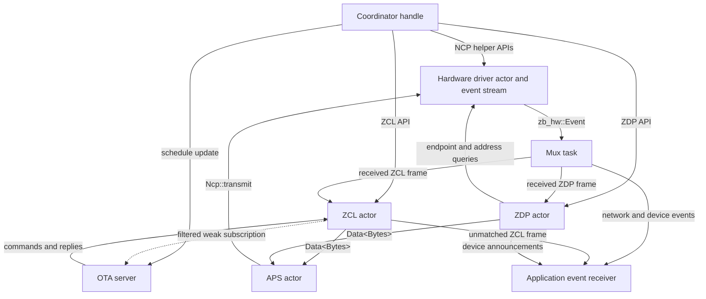
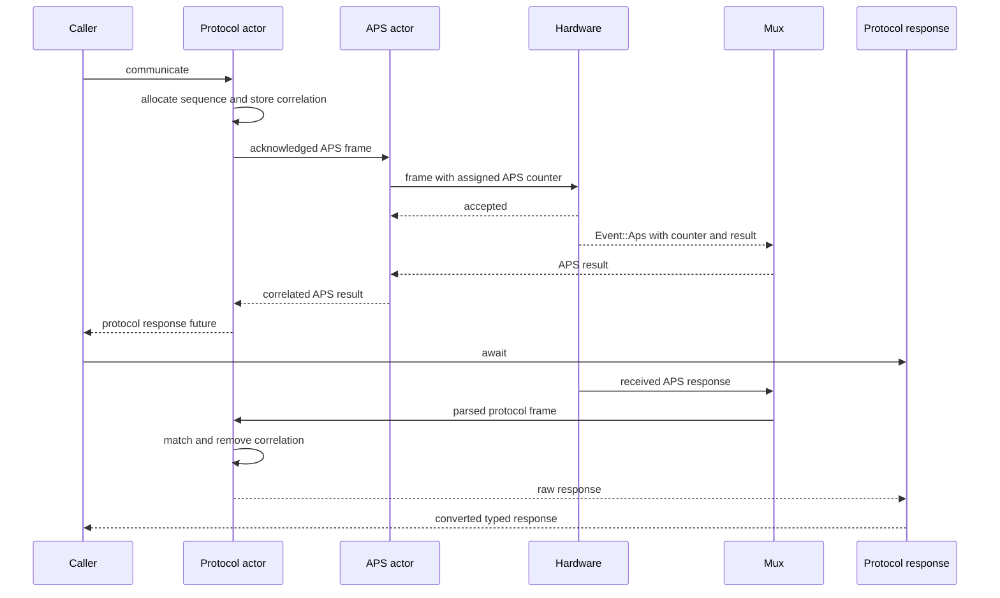
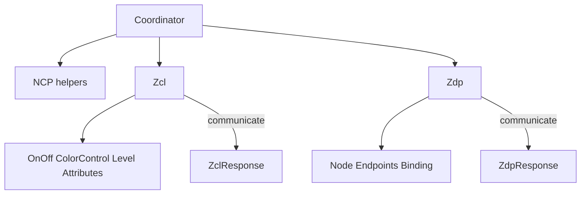

# apis-saltans-coordinator Architecture

The coordinator is a transport and protocol-helper layer built around bounded Tokio actors.
Applications own device registries, discovery policy, retries, binding selection, and persistence.

## Actor Topology


```mermaid
flowchart TD
    HW[Hardware driver actor and event stream]
    C[Coordinator handle]
    APS[APS actor]
    ZCL[ZCL actor]
    ZDP[ZDP actor]
    OTA[OTA server]
    M[Mux task]
    APP[Application event receiver]

    C -->|ZCL API| ZCL
    C -->|ZDP API| ZDP
    C -->|schedule update| OTA
    C -->|NCP helper APIs| HW
    ZCL -->|Data&lt;Bytes&gt;| APS
    ZDP -->|Data&lt;Bytes&gt;| APS
    ZDP -->|endpoint and address queries| HW
    APS -->|Ncp::transmit| HW
    HW -->|zb_hw::Event| M
    M -->|received ZCL frame| ZCL
    M -->|received ZDP frame| ZDP
    M -->|network and device events| APP
    ZCL -->|unmatched ZCL frame| APP
    ZCL -.->|filtered weak subscription| OTA
    OTA -->|commands and replies| ZCL
    ZDP -->|device announcements| APP
```

`Coordinator::start` creates the APS, ZCL, ZDP, and OTA actors plus the event mux. Actor inboxes
use `ZIGBEE_COORDINATOR_MPSC_CHANNEL_SIZE`.

## APS Actor

The APS actor is the only coordinator actor that transmits directly through `zb_hw::Ncp`. It owns a
wrapping `u8` APS frame counter. For every outgoing message it:

1. consumes the supplied APS metadata and serialized payload
2. assigns its next APS frame counter
3. constructs the APS header and `zb_aps::Data<bytes::Bytes>` frame
4. forwards the completed frame and destination to the hardware actor
5. stores an acknowledged caller under the APS counter after hardware acceptance
6. resolves any response replaced by that insertion with `TransmissionError::Timeout`

Its command protocol contains:

```text
Transmit {
    destination: zb_core::Destination,
    metadata: aps::Metadata,
    payload: bytes::Bytes,
    response: Option<oneshot::Sender<Result<(), zb_hw::Error>>>,
}
```

The `Aps` handle wraps the APS actor's `Sender<Message>`. Its inherent `transmit` method creates a
caller response channel only when the metadata contains
`TxOptions::ACKNOWLEDGED_TRANSMISSION` and the destination is a unicast device. The same predicate
controls the APS header acknowledgement-request bit. Group and broadcast transmissions never
request or await APS acknowledgements. Its completion methods forward hardware APS events from the
mux.

- Acknowledged unicast frame: retain the caller's response sender under the APS counter and await
  `ApsEvent::Ack` or `ApsEvent::Nak`.
- Unacknowledged, group, or broadcast frame: omit the caller response and return after actor
  handoff.

Counter replacement occurs only after the hardware accepts a transmission that has an
acknowledgement response. Unacknowledged transmissions have no response to store, and rejected
transmissions never reach the insertion step, so neither replaces an older pending response.

```mermaid
sequenceDiagram
    participant P as ZCL or ZDP actor
    participant O as Previous caller
    participant A as APS actor
    participant H as Hardware actor
    participant M as Event mux

    P->>P: serialize protocol payload
    P->>A: Transmit destination, metadata, payload
    A->>A: assign counter and build Data&lt;Bytes&gt;
    A->>H: transmit destination, frame
    H-->>A: accepted
    opt acknowledged transmission
        A->>A: store response under counter
        opt response was replaced
            A-->>O: TransmissionError::Timeout
        end
        H-->>M: Event::Aps with counter and result
        M-->>A: APS result
        A-->>P: completed APS result
    end
```

## ZCL Actor

The ZCL actor:

- owns the wrapping ZCL transaction sequence
- serializes typed commands into ZCL frames
- sends APS metadata and serialized ZCL frames through the APS actor
- stores response correlation channels for `communicate`
- registers generic filtered subscriptions received through its actor inbox
- delivers matching received frames to generic internal subscriptions before response correlation
- sends replies with an explicitly supplied ZCL transaction sequence
- routes unmatched received commands to the application event channel

For `transmit`, the actor returns only after the APS helper completes. For `communicate`, it inserts
the correlation entry before transmitting, removes it if transmission fails, and returns a
protocol-only response receiver after successful APS completion. Reply transmission uses the same
APS path but preserves the request transaction sequence instead of allocating a new one.

## OTA Upgrade Server

The OTA subsystem installs a ZCL subscription for cluster-specific, client-to-server OTA Upgrade
frames. ZCL applies only the subscription's typed cluster, scope, and direction filter; the OTA actor
performs the typed `Cluster::OtaUpgrade` match. Subscribed frames are delivered before normal
response correlation so client requests cannot be consumed by an unrelated pending operation.
During startup, the coordinator sends the subscription through the ZCL actor handle before starting
the hardware-event mux; subscriptions are not constructor state.

ZCL holds only a weak sender for each subscription. The OTA actor owns the corresponding receiver
and retains its strong sender as a lifetime guard. ZCL therefore has no OTA-specific dependency and
cannot keep the OTA actor alive. When the external OTA inbox closes, the OTA actor exits and drops
its ZCL sender; this avoids a strong ZCL-to-OTA-to-ZCL actor cycle.

Normal OTA commands and replies retain the default acknowledged APS transmission option. Image Page
block responses use empty `TxOptions`; the APS handle therefore returns after actor handoff instead
of creating an acknowledgement response. The page task applies the requested spacing and advances
the ZCL transaction sequence between blocks.

## ZDP Actor

The ZDP actor:

- owns the wrapping ZDP transaction sequence
- uses profile `0x0000` and endpoint `0x00`
- sends APS metadata and serialized ZDP frames through the APS actor
- correlates request and response commands
- queries the NCP directly for endpoint and address information needed while serving ZDP requests
- handles device announcements and selected incoming requests

ZDP responses generated locally also travel through the APS actor, so their APS counters and
acknowledgement behavior follow the same path as outgoing requests.

## Response Correlation

Pending ZCL and ZDP requests are keyed by an internal `Index` containing:

- remote short address
- endpoint
- cluster ID
- profile ID
- optional ZCL manufacturer code
- protocol transaction sequence

The mux parses received APS frames and forwards them to the appropriate protocol actor. Each actor
reconstructs the index from the received frame and removes the matching one-shot sender.


```mermaid
sequenceDiagram
    participant API as Caller
    participant P as Protocol actor
    participant A as APS actor
    participant H as Hardware
    participant M as Mux
    participant R as Protocol response

    API->>P: communicate
    P->>P: allocate sequence and store correlation
    P->>A: acknowledged APS frame
    A->>H: frame with assigned APS counter
    H-->>A: accepted
    H-->>M: Event::Aps with counter and result
    M-->>A: APS result
    A-->>P: correlated APS result
    P-->>API: protocol response future
    API->>R: await
    H->>M: received APS response
    M->>P: parsed protocol frame
    P->>P: match and remove correlation
    P-->>R: raw response
    R-->>API: converted typed response
```

`CommunicationResponse<Raw, T>` no longer contains a hardware future. APS completion occurs before
the response object is returned; the response future only awaits the correlated command and applies
`TryFrom`.

## Mux and Events

The mux consumes `zb_hw::Event` values. It forwards network and device lifecycle events to the
application, reassembles fragmented APS payloads, parses network-profile frames as ZDP, parses
supported application-profile frames as ZCL, and recognizes Keep-Alive traffic before ZCL parsing.

Unmatched ZCL commands and supported device notifications remain application-visible. The
coordinator does not maintain a persistent device table.

## Public Trait Composition


```mermaid
flowchart TD
    C[Coordinator]
    N[NCP helpers]
    ZCL[Zcl]
    ZDP[Zdp]
    CL[OnOff ColorControl Level Attributes]
    DS[Node Endpoints Binding]
    ZCLR[ZclResponse]
    ZDPR[ZdpResponse]

    C --> N
    C --> ZCL
    C --> ZDP
    ZCL --> CL
    ZDP --> DS
    ZCL -->|communicate| ZCLR
    ZDP -->|communicate| ZDPR
```

Command helpers that do not expect a protocol response return `Result<(), Error>` directly.
Communication methods first await APS completion and then return `ZclResponse<T>` or
`ZdpResponse<T>` for the application-level response.
