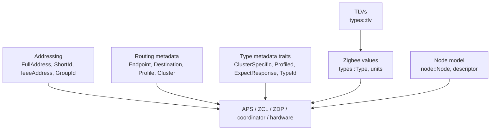
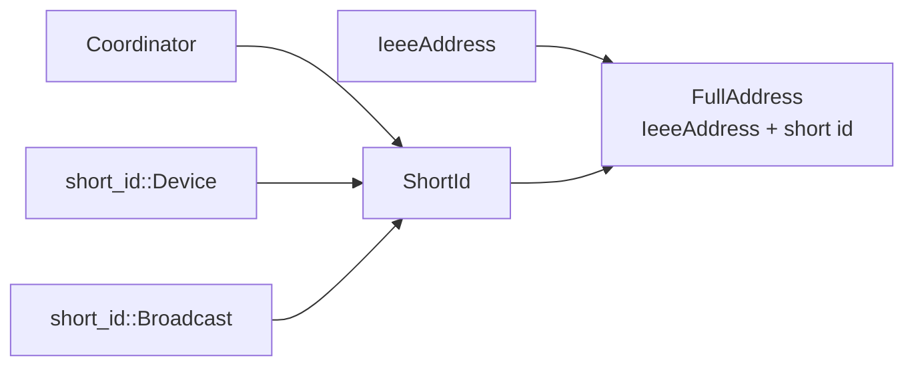

# apis-saltans-core Architecture

`apis-saltans-core` contains shared Zigbee protocol value types. Higher-level
crates use it for addresses, endpoints, profiles, cluster identifiers, typed ZCL
values, TLVs, node descriptors, and small cross-layer traits.

The crate does not implement APS, ZCL, ZDP, coordinator behavior, or hardware
I/O. It keeps domain values and serialization helpers in one dependency that
protocol crates can share.

## Public Layout

| Area | Files and modules | Responsibility |
| --- | --- | --- |
| Addressing | `full_address.rs`, `ieee_address.rs`, `short_id.rs`, `group_id.rs` | IEEE addresses, NWK short addresses, complete device addresses, and APS group identifiers. |
| Routing metadata | `endpoint.rs`, `destination.rs`, `profile.rs`, `cluster.rs`, `direction.rs` | Endpoint, destination, profile, cluster, and command-direction domain values. |
| Traits | `traits.rs`, `cluster.rs`, `profile.rs` | Cross-crate metadata traits such as `ExpectResponse`, `ClusterSpecific`, `Profiled`, and `TypeId`. |
| Typed values | `types.rs`, `types/*` | Zigbee primitive, discrete, analog, composite, and tagged value representations. |
| TLVs | `types/tlv.rs`, `types/tlv/*` | Local, global, and encapsulated TLV representations. |
| Nodes | `node.rs`, `node/descriptor.rs`, `node/descriptor/*` | Node descriptors and descriptor bitfields. |
| Units | `units.rs`, `units/*` | Protocol unit wrappers such as deciseconds, mireds, and units per second. |

## Addressing Model

`IeeeAddress` and `Eui64` represent 64-bit device identifiers. `ShortId`
separates the coordinator address, allocated device short addresses, and Zigbee
broadcast short-address values. `GroupId` accepts only non-zero values in the
valid APS group range.

`FullAddress` combines an IEEE address with a short ID for code paths that
track both identifiers together.

## Routing Metadata

`Endpoint` models the ZDO data endpoint, application endpoints, and the endpoint
broadcast value. The `endpoint` module also exposes `Application`,
`endpoint::Broadcast`, and `endpoint::Reserved` to keep accepted endpoint
subranges distinct.

`Destination` models outbound addressing as one of:

- a device destination,
- a broadcast destination,
- a group destination.

The device and broadcast variants wrap `destination::Device` and
`destination::Broadcast`, which pair the relevant short-address selector with an
endpoint selector. Group destinations carry only `GroupId` because group
membership is endpoint-local on receiving nodes.

`Endpoint` parses the `Data` and `Broadcast` variant names as well as decimal and `0x`-prefixed
numeric IDs, while `Application` accepts the two numeric forms and enforces the application range.
Reserved endpoint IDs remain representable only through `Reserved` errors and are never accepted as
an `Endpoint`.

`Profile` is the Zigbee profile identifier enum. It supports numeric access through `as_u16`,
stable text formatting, and parsing from canonical names or numeric identifiers. Its
`broadcast_endpoint` method returns the endpoint value used for profile-level broadcasts. `Cluster`
is the enum of well-known cluster identifiers defined in this crate and supports the same canonical
name, decimal identifier, and `0x`-prefixed hexadecimal parsing forms as `Profile`, while
`ClusterSpecific<T = u16>` lets downstream command and attribute types expose
their own cluster ID as metadata.

`Profiled` is separate from `ClusterSpecific` so a type can expose its profile
without making profile metadata part of the cluster trait.

## Typed Values And TLVs

`types::Type` is the tagged Zigbee value enum. It wraps null values, discrete
byte blocks, booleans, dates, times, analog integers, strings, identifiers, and
other scalar values used by ZCL and ZDP payloads.

Each payload type implements `TypeId` to expose the tag as an `ID` constant.
When two variants share an underlying representation but have different tags,
transparent newtypes keep their type-level IDs unambiguous without changing the
serialized bytes.

TLV support is under `types::tlv`. `Tlv<L, G>` distinguishes local and global
tag ranges, while the concrete local and global enums provide typed payloads
for known tags. TLV length fields follow the Zigbee convention where the stored
length is `payload_len - 1`.

Serialization uses `le-stream` traits. Implementations return iterators for
encoding and parse from byte iterators for decoding.

## Error Model

Public parsing and conversion errors derive `thiserror::Error`. Variant messages live beside their
domain variants through `#[error(...)]`; retained lower-level failures use `#[from]` so conversion
and source chaining stay consistent. Unit parse errors carry no rejected input and therefore expose
only their domain-specific display message.

## Dependency Boundaries

The core crate is intentionally below all protocol and runtime crates:

- It may define generic domain values and serialization behavior.
- It must not depend on APS, ZCL, ZDP, coordinator, or hardware crates.
- Higher-level crates attach behavior to these values through their own command,
  frame, and dispatch types.
