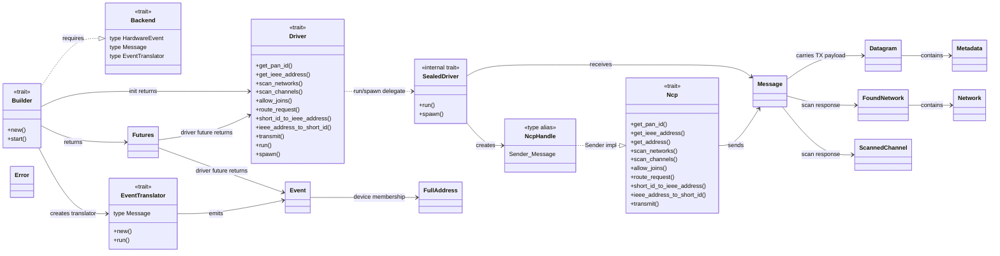
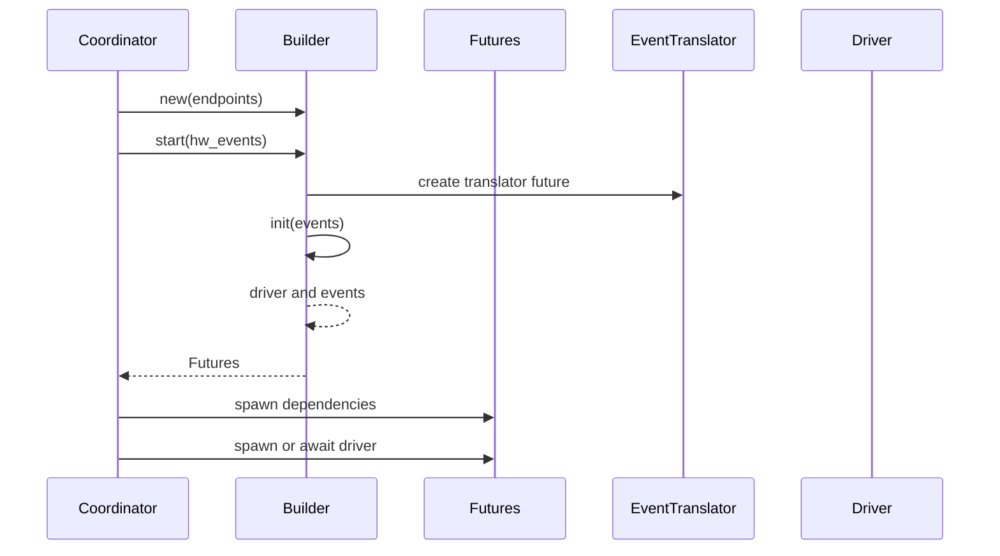
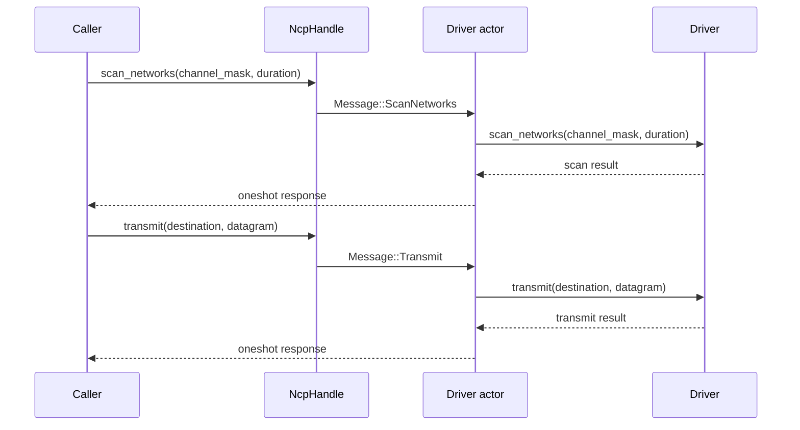
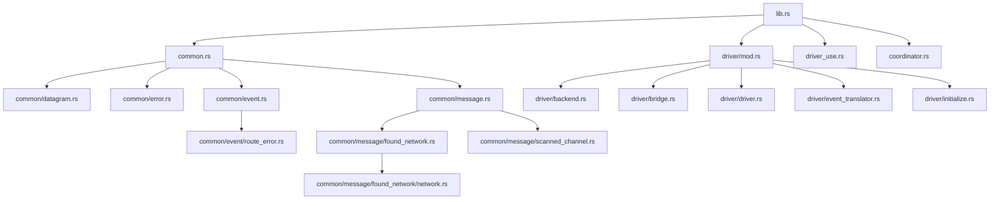

# apis-saltans-hw Architecture

`apis-saltans-hw` is the hardware abstraction crate between coordinator logic and concrete Zigbee
network co-processor (NCP) drivers. The crate is actor-oriented: callers hold an `NcpHandle`,
send internal `Message` commands through the `Ncp` trait, and receive responses through one-shot
channels owned by each message.

## Boundaries

- The `driver-use` feature exposes `NcpHandle`, `Builder`, and `Futures` for code that starts and
  uses an existing hardware backend. It also exposes `Error`, `RouteError`, and `WeakNcpHandle`
  because startup code needs the command handle and common error surface.
- The `driver` feature includes `driver-use` and additionally exposes `Backend`, `Driver`,
  `EventTranslator`, `bridge`, driver-side data types, and protocol crate re-export modules for
  hardware backend implementations.
- The `coordinator` feature exposes `Ncp`, `NcpHandle`, `WeakNcpHandle`, common error types, and
  coordinator-side data/event types for coordinator code.
- `Backend` defines the hardware-specific event, translator message, and translator types.
- `Builder` creates a configured backend from the coordinator endpoint descriptors and prepares
  support tasks.
- `Builder::init` starts the backend and returns its driver together with the translated event
  receiver.
- `Driver` is the implementor-facing NCP command API.
- `Ncp` is the caller-facing proxy API implemented for `tokio::sync::mpsc::Sender<Message>`.
- `EventTranslator` converts backend-specific event messages into common `Event` values.
- `Datagram` carries serialized application payload bytes together with APS `Metadata`.
- `Datagram`, `Metadata`, `Event`, `FoundNetwork`, `Network`, and `ScannedChannel` are exported by
  `coordinator` and `driver`.
- `Error`, `RouteError`, `NcpHandle`, and `WeakNcpHandle` are exported by `coordinator` and
  `driver-use`; because `driver` includes `driver-use`, driver crates receive them too.

## Public Re-Exports

| Export | Feature | Defined in | Purpose |
| --- | --- | --- | --- |
| `Backend` | `driver` | `driver/backend.rs` | Defines backend-specific event and translator types. |
| `bridge` | `driver` | `driver/bridge.rs` | Forwards and converts messages between Tokio MPSC channels. |
| `Builder` | `driver-use` | `driver_use.rs` | Constructs and starts a configured hardware backend. |
| `Datagram` | `driver` or `coordinator` | `common/datagram.rs` | Serialized application payload plus APS metadata. |
| `Driver` | `driver` | `driver/driver.rs` | Driver-side command API implemented by hardware backends. |
| `Error` | `driver-use`, `driver`, or `coordinator` | `common/error.rs` | Common crate error type. `driver` receives this through `driver-use`. |
| `Event` | `driver` or `coordinator` | `common/event.rs` | Common hardware-layer event model. |
| `EventTranslator` | `driver` | `driver/event_translator.rs` | Converts backend event messages into `Event` values. |
| `FoundNetwork` | `driver` or `coordinator` | `common/message/found_network.rs` | Network scan result plus last-hop signal quality. |
| `Metadata` | `driver` or `coordinator` | `common/datagram.rs` | APS profile and cluster metadata for a `Datagram`. |
| `Ncp` | `coordinator` | `coordinator.rs` | Caller-side API implemented for `NcpHandle`. |
| `NcpHandle` | `driver-use`, `driver`, or `coordinator` | `common.rs` | `tokio::sync::mpsc::Sender<Message>`, the actor command handle. |
| `Network` | `driver` or `coordinator` | `common/message/found_network/network.rs` | Basic network information discovered during scans. |
| `RouteError` | `driver-use`, `driver`, or `coordinator` | `common/event/route_error.rs` | Route error payload used in translated hardware events. |
| `Futures` | `driver-use` | `driver_use.rs` | Runtime futures for starting and driving a hardware backend. |
| `ScannedChannel` | `driver` or `coordinator` | `common/message/scanned_channel.rs` | Channel scan result. |
| `WeakNcpHandle` | `driver-use`, `driver`, or `coordinator` | `common/message.rs` | Weak sender handle for components that should not keep the actor alive. |
| `aps` | `driver` | `reexports.rs` | Re-export of `zb-aps` for driver crates. |
| `core` | `driver` | `reexports.rs` | Re-export of `zb-core` for driver crates. |
| `nwk` | `driver` | `reexports.rs` | Re-export of `zb-nwk` for driver crates. |
| `zdp` | `driver` | `reexports.rs` | Re-export of `zb-zdp` for driver crates. |

Internal modules define additional items used by the public API but not directly exported:

| Item | Defined in | Purpose |
| --- | --- | --- |
| `Message` | `common/message.rs` | Internal actor command protocol between `NcpHandle` and the driver actor. |
| `SealedDriver` | `driver/driver.rs` | Blanket-implemented actor runtime for every `Driver + Send + 'static`. |

## Component Relationships

## Startup Flow

## Actor Command Flow

Each proxy call maps to one internal `Message` and one driver call. Destination-specific delivery
semantics are represented by `zb_core::Destination`; the hardware abstraction no longer
has separate unicast, multicast, and broadcast actor messages.

## Module Inventory

## Command Protocol

`Message` is the private actor protocol carried by `NcpHandle`. Each variant owns a one-shot
response sender so the actor can return the result of the corresponding driver call.

| `Ncp` method | `Message` variant | `Driver` method |
| --- | --- | --- |
| `get_pan_id` | `GetPanId` | `get_pan_id` |
| `get_ieee_address` | `GetIeeeAddress` | `get_ieee_address` |
| `scan_networks` | `ScanNetworks` | `scan_networks` |
| `scan_channels` | `ScanChannels` | `scan_channels` |
| `allow_joins` | `AllowJoins` | `allow_joins` |
| `route_request` | `RouteRequest` | `route_request` |
| `short_id_to_ieee_address` | `TranslateIeeeAddress` | `short_id_to_ieee_address` |
| `ieee_address_to_short_id` | `TranslateShortId` | `ieee_address_to_short_id` |
| `transmit` | `Transmit` | `transmit` |

## Data Model

`Datagram` is the transmit payload passed to the driver. It contains:

- `Metadata`, which identifies the APS profile and cluster.
- `bytes::Bytes`, which contains the serialized application payload.

`Event` is the receive-side model emitted by the event translator. It reports network state changes,
device join/rejoin/leave notifications carrying `zb_core::FullAddress`, route errors, and
raw received APS data as `zb_nwk::Envelope<zb_aps::Data<bytes::Bytes>>`.

Scan commands use `FoundNetwork`, `Network`, and `ScannedChannel` to report network discovery and
channel activity results without exposing backend-specific scan response formats.

## Error Handling

`Error` is intentionally small:

- `Implementation` wraps backend-specific errors.
- `DriverSend` means the actor command channel was closed.
- `DriverRecv` means the one-shot response channel was closed.
- `NotImplemented` represents unsupported backend features.
- `NoEndpoints` represents startup without endpoint descriptors.
