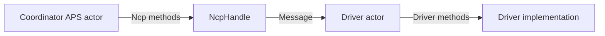
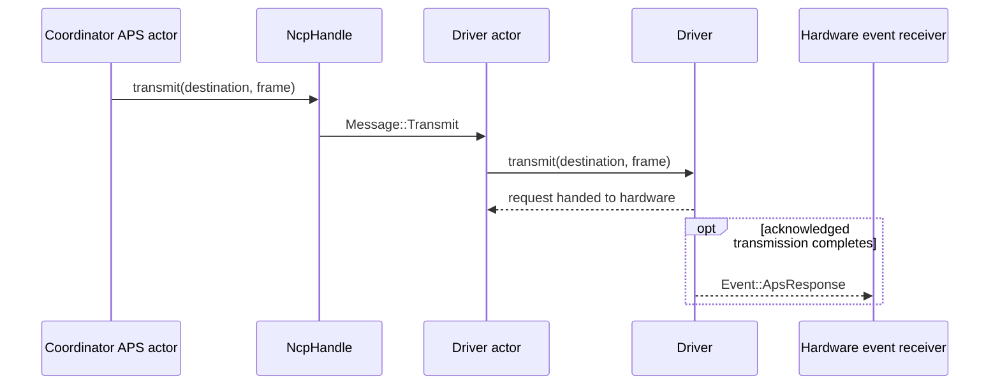
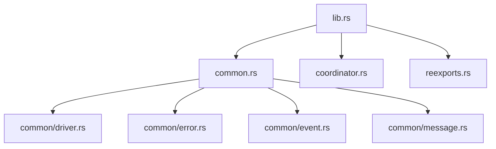

# apis-saltans-hw Architecture

`apis-saltans-hw` is the actor-oriented boundary between coordinator logic and concrete Zigbee
network co-processor drivers. Callers hold an `NcpHandle`, use the `Ncp` trait to enqueue commands,
and receive results through one-shot channels carried by the actor messages.

## Boundaries

- The `driver` feature exposes the `Driver` contract, actor handles, common events and errors, and
  protocol crate re-exports for backend implementations.
- The `coordinator` feature adds the caller-facing `Ncp` proxy trait.
- Every driver supplies its local `SimpleDescriptor` values through `Driver::get_endpoints`.
- Backends own transport startup and hardware-event conversion.
- Outgoing payloads cross the hardware boundary as complete `zb_aps::Data<bytes::Bytes>` frames.
- `Datagram`, its separate metadata, and the deferred `HwResponse` abstraction are no longer part of
  the hardware API.

## Actor Topology

`NcpHandle` is a bounded Tokio MPSC sender. `SealedDriver` owns the receive loop and dispatches each
`Message` variant to the corresponding `Driver` method.

## Transmission Flow

The transmit message carries:

- the NWK `zb_core::Destination`
- a complete `zb_aps::Data<bytes::Bytes>` frame

`Ncp::transmit` only awaits insertion into the driver actor mailbox. The transmit command never
carries a response channel. For acknowledged APS transmissions the backend later emits
`Event::ApsResponse(Result<u8, Error>)`, where success carries the transmitted frame's APS counter.
Unacknowledged transmissions emit no APS response event.

`Driver::transmit` initiates the backend APS operation and returns `()`. There is no nested or opaque
completion future.

## Other Commands

All non-transmit commands retain a required response channel. The `Ncp` proxy creates the one-shot
pair, enqueues the message, and awaits the result.

| `Ncp` method | `Message` variant | `Driver` method |
| --- | --- | --- |
| `get_endpoints` | `GetEndpoints` | `get_endpoints` |
| `get_pan_id` | `GetPanId` | `get_pan_id` |
| `get_ieee_address` | `GetIeeeAddress` | `get_ieee_address` |
| `scan_networks` | `ScanNetworks` | `scan_networks` |
| `scan_channels` | `ScanChannels` | `scan_channels` |
| `allow_joins` | `AllowJoins` | `allow_joins` |
| `route_request` | `RouteRequest` | `route_request` |
| `short_id_to_ieee_address` | `TranslateIeeeAddress` | `short_id_to_ieee_address` |
| `ieee_address_to_short_id` | `TranslateShortId` | `ieee_address_to_short_id` |
| `transmit` | `Transmit` | `transmit` |

## Module Layout

`common/message.rs` defines the private actor protocol and handle aliases.
`common/driver.rs` defines the public driver contract plus the blanket actor runtime.
`coordinator.rs` defines the `Ncp` proxy implemented for `NcpHandle`.

## Receive-Side Events

Hardware integrations translate backend-specific events into the common `Event` model. Received
APS data already uses typed `zb_aps::Data<bytes::Bytes>` values, matching the outgoing transport
boundary. Startup, event-task ownership, and backend configuration remain outside this crate.
