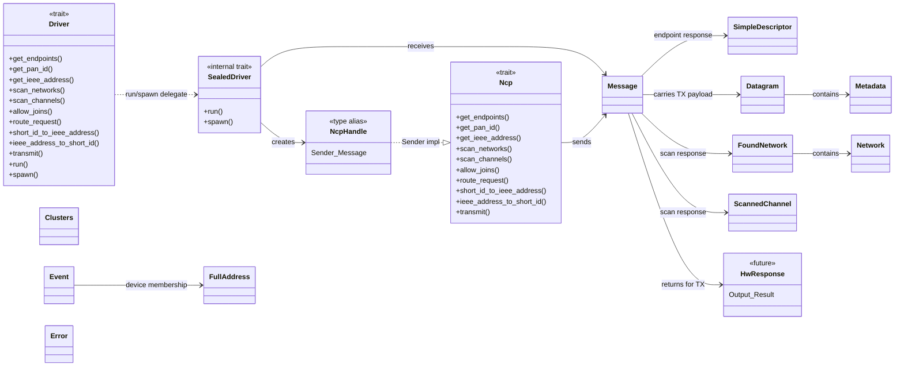
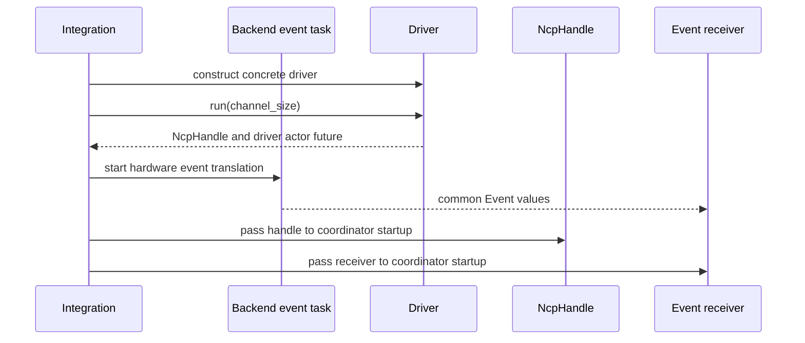
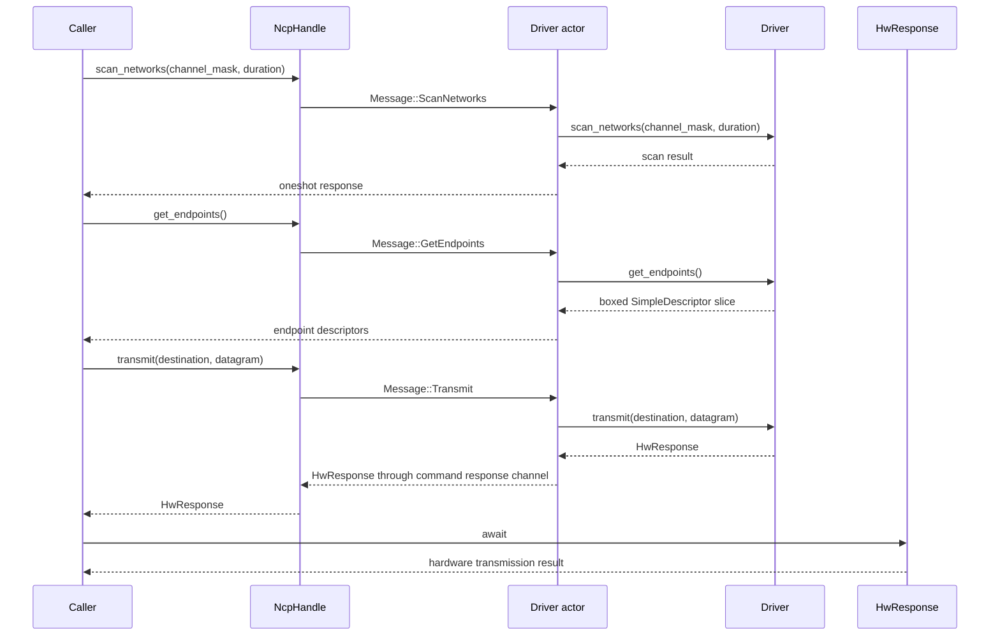
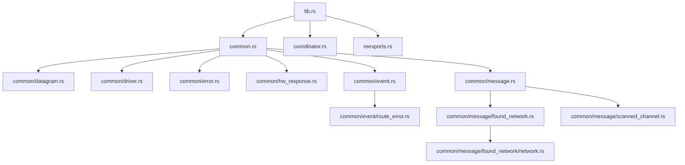

# apis-saltans-hw Architecture

`apis-saltans-hw` is the hardware abstraction crate between coordinator logic and concrete Zigbee
network co-processor (NCP) drivers. The crate is actor-oriented: callers hold an `NcpHandle`,
send internal `Message` commands through the `Ncp` trait, and receive actor responses through
one-shot channels owned by each message. Transmission completion is represented separately by the
opaque `HwResponse` future.

## Boundaries

- The `driver` feature exposes `Driver`, shared coordinator/driver data types, command handles,
  common error types, and protocol crate re-export modules for hardware backend implementations.
- The `coordinator` feature exposes `Ncp`, `Driver`, `NcpHandle`, `WeakNcpHandle`, common error
  types, and coordinator-side data/event types for coordinator code.
- `Driver` is the implementor-facing NCP command API.
- `Driver` and all common hardware types are available with either feature. The `driver` feature
  additionally exposes the protocol crate re-export modules, while `coordinator` adds `Ncp`.
- Every `Driver` must implement `get_endpoints` and return a complete `SimpleDescriptor` for each
  local application endpoint exposed by the NCP.
- `Ncp` is the caller-facing proxy API implemented for `tokio::sync::mpsc::Sender<Message>`.
- `Ncp::get_endpoints` forwards the driver's descriptor set to coordinator-level ZDP and binding
  code; the hardware layer is the source of truth for local endpoints.
- `Driver::transmit` starts a transmission and returns an `HwResponse` that owns its deferred
  completion future.
- `Ncp::transmit` returns that `HwResponse` after actor handoff instead of awaiting hardware
  completion inside the proxy method.
- Backends own transport startup and conversion of hardware-specific events into common `Event`
  values; the hardware crate does not impose a backend configuration or translator abstraction.
- `Datagram` carries serialized application payload bytes together with APS `Metadata`.
- `Datagram`, `Metadata`, `Event`, `FoundNetwork`, `HwResponse`, `Network`, and `ScannedChannel` are
  exported by `coordinator` and `driver`.
- `Error`, `RouteError`, `NcpHandle`, and `WeakNcpHandle` are exported by `coordinator` and
  `driver`.

## Public Re-Exports

| Export | Feature | Defined in | Purpose |
| --- | --- | --- | --- |
| `Clusters` | `driver` or `coordinator` | `common/clusters.rs` | Compact validated cluster-set helper; endpoint queries use full ZDP simple descriptors. |
| `Datagram` | `driver` or `coordinator` | `common/datagram.rs` | Serialized application payload plus APS metadata. |
| `Driver` | `driver` or `coordinator` | `common/driver.rs` | Driver-side command API implemented by hardware backends. |
| `Error` | `driver` or `coordinator` | `common/error.rs` | Common crate error type. |
| `Event` | `driver` or `coordinator` | `common/event.rs` | Common hardware-layer event model. |
| `FoundNetwork` | `driver` or `coordinator` | `common/message/found_network.rs` | Network scan result plus last-hop signal quality. |
| `HwResponse` | `driver` or `coordinator` | `common/hw_response.rs` | Opaque deferred hardware-operation future. |
| `Metadata` | `driver` or `coordinator` | `common/datagram.rs` | APS profile and cluster metadata for a `Datagram`. |
| `Ncp` | `coordinator` | `coordinator.rs` | Caller-side API implemented for `NcpHandle`. |
| `NcpHandle` | `driver` or `coordinator` | `common.rs` | `tokio::sync::mpsc::Sender<Message>`, the actor command handle. |
| `Network` | `driver` or `coordinator` | `common/message/found_network/network.rs` | Basic network information discovered during scans. |
| `RouteError` | `driver` or `coordinator` | `common/event/route_error.rs` | Route error payload used in translated hardware events. |
| `ScannedChannel` | `driver` or `coordinator` | `common/message/scanned_channel.rs` | Channel scan result. |
| `WeakNcpHandle` | `driver` or `coordinator` | `common/message.rs` | Weak sender handle for components that should not keep the actor alive. |
| `aps` | `driver` | `reexports.rs` | Re-export of `zb-aps` for driver crates. |
| `core` | `driver` | `reexports.rs` | Re-export of `zb-core` for driver crates. |
| `nwk` | `driver` | `reexports.rs` | Re-export of `zb-nwk` for driver crates. |
| `zdp` | `driver` | `reexports.rs` | Re-export of `zb-zdp` for driver crates. |

Internal modules define additional items used by the public API but not directly exported:

| Item | Defined in | Purpose |
| --- | --- | --- |
| `Message` | `common/message.rs` | Internal actor command protocol between `NcpHandle` and the driver actor. |
| `SealedDriver` | `common/driver.rs` | Blanket-implemented actor runtime for every `Driver + Send + 'static`. |

## Component Relationships

## Driver Runtime Flow

Backend crates own concrete startup, transport wiring, and event translation. The `hw` crate
supplies the common driver actor and event model, but does not prescribe backend configuration,
translator traits, channel bridges, or a separate startup feature.

## Actor Command Flow

Each proxy call maps to one internal `Message` and one driver call. Destination-specific delivery
semantics are represented by `zb_core::Destination`; the hardware abstraction no longer
has separate unicast, multicast, and broadcast actor messages.

The transmit path differs from other proxy calls at the response boundary. The first await sends
`Message::Transmit`, waits for the driver to start the operation, and returns the driver's
`HwResponse`. The caller decides when to await that response for the deferred result. This lets the
coordinator wrap hardware completion together with a later ZCL or ZDP response without exposing the
driver's concrete completion mechanism.

## Module Inventory

## Command Protocol

`Message` is the private actor protocol carried by `NcpHandle`. Each variant owns a one-shot
response sender so the actor can return the result of the corresponding driver call.

| `Ncp` method | `Message` variant | `Driver` method |
| --- | --- | --- |
| `get_endpoints` | `GetEndpoints` | `get_endpoints` |
| `get_pan_id` | `GetPanId` | `get_pan_id` |
| `get_ieee_address` | `GetIeeeAddress` | `get_ieee_address` |
| `scan_networks` | `ScanNetworks` | `scan_networks` |
| `scan_channels` | `ScanChannels` | `scan_channels` |
| `allow_joins` | `AllowJoins` | `allow_joins` |
| `route_request` | `RouteRequest` | `route_request` |
| `short_id_to_ieee_address` | `TranslateIeeeAddress` | `short_id_to_ieee_address` |
| `ieee_address_to_short_id` | `TranslateShortId` | `ieee_address_to_short_id` |
| `transmit` | `Transmit` | `transmit`; the proxy returns `HwResponse` before hardware completion |

## Data Model

`get_endpoints` returns a boxed slice of `zb_zdp::SimpleDescriptor` values. Each descriptor carries
the endpoint ID, profile ID, device ID, application version, and raw input/output cluster IDs needed
to advertise the endpoint and answer ZDP requests. Drivers must return every local application
endpoint exposed by the NCP. The coordinator does not maintain a separate descriptor list.

`Clusters` remains a compact helper for validated input and output `zb_core::Cluster` sets, but it is
not the endpoint-query return type.

`Datagram` is the transmit payload passed to the driver. It contains:

- `Metadata`, which identifies the APS profile and cluster and carries the complete
  `zb_aps::TxOptions` mask for the APSDE-DATA request.
- `bytes::Bytes`, which contains the serialized application payload.

`HwResponse` owns a boxed, pinned, `Send + 'static` future supplied by the driver. Its public future
output is `Result<(), Error>`; `HwResponse::new` converts a backend future's error into the common
error type. Keeping the future opaque allows different drivers to use different completion
mechanisms without changing the coordinator-facing API.

`Event` is the receive-side model emitted by the event translator. It reports network state changes,
device join/rejoin/leave notifications carrying `zb_core::FullAddress`, route errors, and
raw received APS data as `zb_nwk::Envelope<zb_aps::Data<bytes::Bytes>>`.

Scan commands use `FoundNetwork`, `Network`, and `ScannedChannel` to report network discovery and
channel activity results without exposing backend-specific scan response formats.

## Error Handling

`Error` is intentionally small:

- `Implementation` wraps backend-specific errors.
- `DriverSend` means the actor command channel was closed.
- `DriverRecv` means the one-shot response channel was closed.
- `NotImplemented` represents unsupported backend features.
- `NoEndpoints` means the NCP did not provide any required local endpoint descriptors.

The common and routing error enums derive `thiserror::Error`. `Implementation` retains its
backend-specific error as the source. Actor send and receive conversions remain explicit because
they intentionally reduce Tokio's channel errors to payload-free variants.
