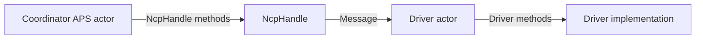
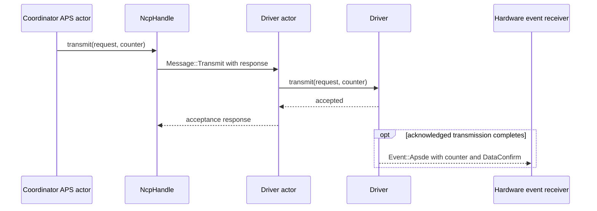
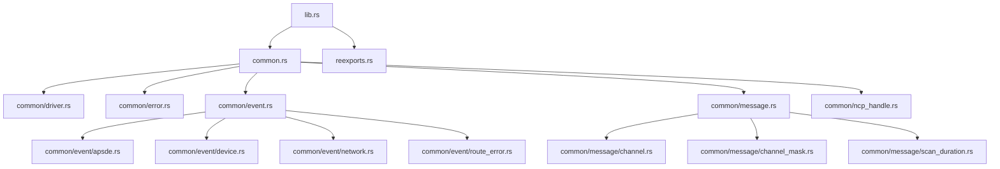

# apis-saltans-hw Architecture

`apis-saltans-hw` is the actor-oriented boundary between coordinator logic and concrete Zigbee
network co-processor drivers. Callers use the inherent methods on `NcpHandle` to enqueue commands
and receive results through one-shot channels carried by the actor messages.

## Boundaries

- The `types` feature exposes opaque actor handles, common events and errors, and typed scan values.
- The `driver` feature adds the `Driver` contract and protocol crate re-exports.
- The `coordinator` feature adds the caller-facing methods on `NcpHandle`.
- Every driver supplies its local `SimpleDescriptor` values through `Driver::get_endpoints`.
- Backends own transport startup and hardware-event conversion.
- Outgoing payloads cross the hardware boundary as
  `zb_aps::apsde::DataRequest<bytes::Bytes>` values plus an APS correlation counter.
- `Datagram`, its separate metadata, and the deferred `HwResponse` abstraction are no longer part of
  the hardware API.

## Actor Topology

```mermaid
flowchart LR
    C[Coordinator APS actor]
    H[NcpHandle]
    A[Driver actor]
    D[Driver implementation]

    C -->|NcpHandle methods| H
    H -->|Message| A
    A -->|Driver methods| D
```

`NcpHandle` is an opaque wrapper around a bounded Tokio MPSC sender. `Driver::into_actor` returns
the handle plus an unspawned future that owns the receive loop and dispatches each private `Message`
variant to the corresponding `Driver` method.

## Transmission Flow

The transmit message carries:

- an APS `DataRequest<bytes::Bytes>`
- the wrapping `u8` APS counter assigned by the coordinator APS actor
- a one-shot backend-acceptance response

```mermaid
sequenceDiagram
    participant APS as Coordinator APS actor
    participant H as NcpHandle
    participant A as Driver actor
    participant D as Driver
    participant E as Hardware event receiver

    APS->>H: transmit(request, counter)
    H->>A: Message::Transmit with response
    A->>D: transmit(request, counter)
    D-->>A: accepted
    A-->>H: acceptance response
    opt acknowledged transmission completes
        D-->>E: Event::Apsde with counter and DataConfirm
    end
```

`NcpHandle::transmit` awaits backend acceptance. For acknowledged APS transmissions the backend
later emits `Event::Apsde(ApsdeEvent::DataConfirm { counter, confirmation })`. The hardware
interface deliberately supplies the wrapping eight-bit APS counter alongside both the
standards-based request and confirmation because `DataConfirm` has no correlation handle.
The coordinator handles collisions when it reuses a counter. Unacknowledged transmissions emit no
APS completion event.

`Driver::transmit` reports whether the backend accepted the request. Eventual acknowledged completion
remains asynchronous.

## Other Commands

Every command carries a required response channel. `NcpHandle` creates the one-shot pair, enqueues
the message, and awaits the result.

| `NcpHandle` method | `Message` variant | `Driver` method |
| --- | --- | --- |
| `get_endpoints` | `GetEndpoints` | `get_endpoints` |
| `get_pan_id` | `GetPanId` | `get_pan_id` |
| `get_ieee_address` | `GetIeeeAddress` | `get_ieee_address` |
| `scan_networks` | `ScanNetworks` | `scan_networks` |
| `scan_channels` | `ScanChannels` | `scan_channels` |
| `allow_joins` | `AllowJoins` | `allow_joins` |
| `route_request` | `RouteRequest` | `route_request` |
| `short_id_to_ieee_address` | `TranslateIeeeAddress` | `short_id_to_ieee_address` |
| `ieee_address_to_short_id` | `TranslateShortId` | `ieee_address_to_short_id` |
| `transmit` | `Transmit` | `transmit` |

## Module Layout

```mermaid
flowchart TD
    L[lib.rs] --> C[common.rs]
    L --> R[reexports.rs]
    C --> D[common/driver.rs]
    C --> E[common/error.rs]
    C --> V[common/event.rs]
    C --> M[common/message.rs]
    C --> H[common/ncp_handle.rs]
    M --> CH[common/message/channel.rs]
    M --> CM[common/message/channel_mask.rs]
    M --> SD[common/message/scan_duration.rs]
    V --> AV[common/event/apsde.rs]
    V --> DV[common/event/device.rs]
    V --> NV[common/event/network.rs]
    V --> RV[common/event/route_error.rs]
```

`common/message.rs` defines the private actor protocol.
`common/ncp_handle.rs` defines the strong and weak handles and the caller-facing proxy methods.
`common/driver.rs` defines the public driver contract plus the actor runtime.
`common/event.rs` groups the APSDE, device, and network event categories.

## Receive-Side Events

Hardware integrations translate backend-specific events into the common `Event` model. `Event`
groups notifications into `NetworkEvent`, `DeviceEvent`, and `ApsdeEvent<T, K>` values. Incoming
application-service data uses `DataIndication<bytes::Bytes, T, K>`, and acknowledged completion uses
`DataConfirm<T>` plus the coordinator correlation counter. The generic timestamp and key-pair
handle preserve backend-native representations. Startup, event-task ownership, and backend
configuration remain outside this crate.
