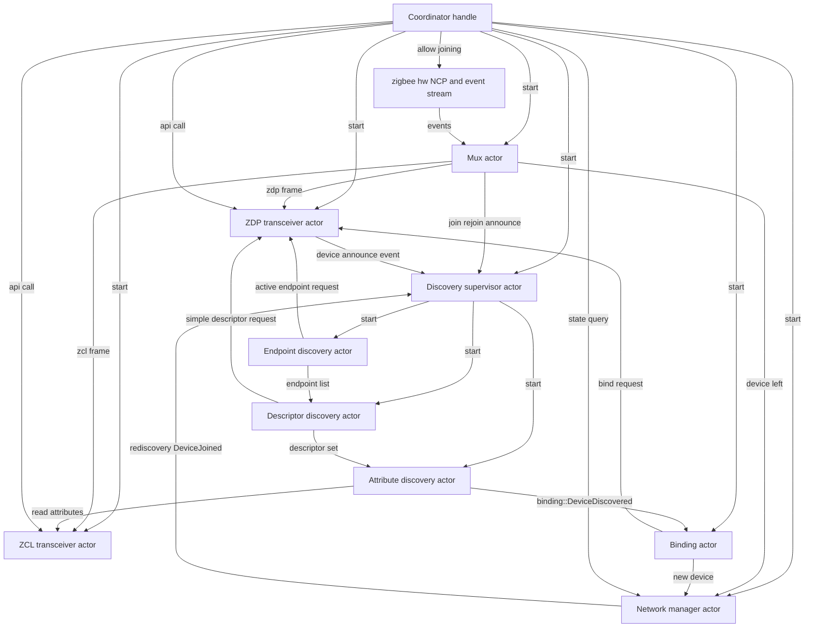
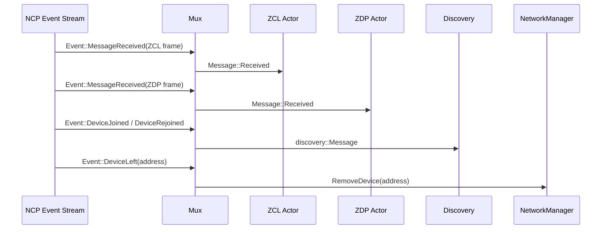
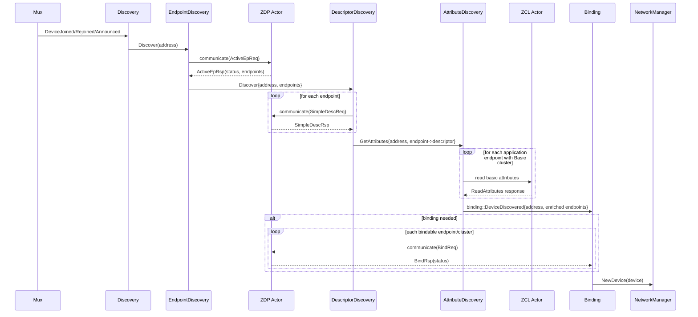
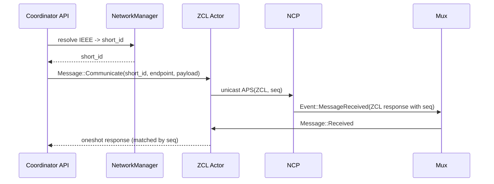
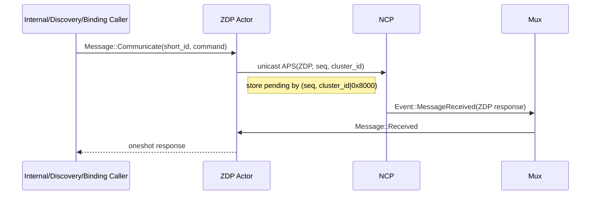
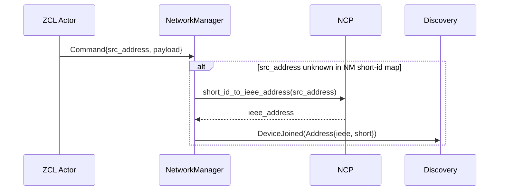

# zigbee-coordinator Architecture

This document explains how the coordinator is implemented internally, with a focus on:
- actor responsibilities
- channel topology
- end-to-end message flow
- retry/timeout and response correlation behavior

## Overview

`zigbee-coordinator` uses an actor-style runtime on top of `tokio`:
- each major subsystem runs in its own async loop (`run(...)`)
- subsystems communicate via `tokio::sync::mpsc` and `oneshot`
- long-running or per-device work is offloaded to bounded task pools (`tokio-task-pool`)

At startup, `Coordinator::start(...)` wires the full graph and returns a lightweight API handle containing key senders and the NCP handle.

## Actor Topology

## Startup and Wiring

`Coordinator::start(...)` performs these steps:
1. Starts hardware via `Start::start(...)` and receives `(NcpHandle, Receiver<Event>)`.
2. Starts `NetworkManager` with initial persistent `State`.
3. Starts `ZCL` and `ZDP` transceivers.
4. Starts `Mux`, which fans out inbound hardware events.
5. Starts `Binding` actor and keeps its sender for downstream discovery handoff.
6. Starts `Discovery` supervisor with weak links to `ZCL`, `ZDP`, and `Binding`.
7. Inside discovery startup, workers are wired as `ED -> DD -> AD`, and `AD` forwards completed devices directly to `Binding`.

All major actor inboxes are bounded MPSC channels (size configurable by `ZIGBEE_COORDINATOR_MPSC_CHANNEL_SIZE`).

## Actor Responsibilities

### Coordinator (API facade)

Holds:
- `ncp: NcpHandle`
- sender to `ZCL` actor
- sender to `ZDP` actor
- sender to `NetworkManager`
- sender to `Binding` actor

Implements user-facing traits (`OnOff`, `ColorControl`, `ReadAttributes`, `WriteAttributes`, `Joining`, `NetworkManager`) by forwarding requests to actors and composing responses.

### Mux

Consumes raw hardware `Event`s and routes:
- `MessageReceived` with ZCL payload -> `ZCL` actor
- `MessageReceived` with ZDP payload -> `ZDP` actor
- `DeviceJoined` / `DeviceRejoined` -> `Discovery`
- `DeviceLeft` -> `NetworkManager::RemoveDevice`

### ZCL Transceiver

Responsibilities:
- send ZCL unicast/multicast through NCP
- receive inbound ZCL frames from `Mux`
- correlate response frames to pending requests

Important details:
- correlation key is ZCL sequence number (`seq`)
- pending requests are stored in `responses: BTreeMap<u8, oneshot::Sender<Cluster>>`
- `communicate(...)` sends a command and returns a oneshot-backed response future

### ZDP Transceiver

Responsibilities:
- send ZDP unicast requests through NCP (endpoint `Data`)
- receive inbound ZDP frames from `Mux`
- correlate response frames to pending requests
- handle two special inbound requests locally:
  - `MatchDescReq` -> generate and send `MatchDescRsp`
  - `DeviceAnnce` -> forward as discovery signal

Important details:
- correlation key is `(seq, response_cluster_id)`
- request cluster ID is converted with `0x8000` response mask before storing
- pending requests are stored in `responses: BTreeMap<(u8,u16), oneshot::Sender<Command>>`

### Discovery Supervisor

Receives high-level discovery triggers and feeds endpoint discovery:
- `DeviceJoined`
- `DeviceRejoined`
- `DeviceAnnounced`

Internally owns and starts:
- `EndpointDiscovery` (`ED`)
- `DescriptorDiscovery` (`DD`)
- `AttributeDiscovery` (`AD`)

Wiring detail:
- supervisor emits discovery work only to `ED`
- `ED` forwards to `DD`, `DD` forwards to `AD`
- `AD` does not route back through the supervisor; it forwards directly to `Binding`

### EndpointDiscovery (ED)

For each target device:
- sends `ActiveEpReq` (via ZDP)
- retries using global retry policy (`RETRY`)
- on success forwards endpoint set to `DescriptorDiscovery`

### DescriptorDiscovery (DD)

For each discovered endpoint:
- sends `SimpleDescReq` (via ZDP)
- tracks per-device endpoint completion
- when all descriptors are resolved, forwards `(Endpoint -> SimpleDescriptor)` map to `AttributeDiscovery`

### AttributeDiscovery (AD)

For each application endpoint containing the Basic cluster:
- reads a fixed attribute set from `zcl::general::basic`
- converts read results into coordinator `Attributes`
- when complete, sends `binding::Message::DeviceDiscovered` directly to `Binding`

### Binding

For endpoints that advertise bindable output clusters (`OnOff`, `Level`):
- sends `BindReq` via ZDP to bind device endpoint -> coordinator IEEE + default endpoint
- tracks per-endpoint/per-cluster bind completion
- once binding is complete (or not needed), forwards `NewDevice` to `NetworkManager`

### NetworkManager

In-memory source of truth for known devices:
- `devices: BTreeMap<MacAddr8, Device>`
- `short_ids: BTreeMap<u16, MacAddr8>`

Handles:
- add/remove device updates
- short<->IEEE resolution
- full state snapshots
- rediscovery trigger: if an incoming command arrives from an unknown short ID, it resolves IEEE via NCP and sends `discovery::Message::DeviceJoined` to `Discovery`

`Subscribe` exists in message API but is currently `todo!()` in actor logic.

## Key Message Flows

## 1) Incoming hardware event routing

## 2) Discovery pipeline (join -> device model)

## 3) API command with response (ZCL)

## 4) API command with response (ZDP)

## 5) Rediscovery back-channel (unknown command source)

## Concurrency Model

- Actor mailboxes are serialized per actor (single message loop).
- Potentially slow remote interactions (endpoint/descriptor/attribute/binding steps) run as separate tasks in bounded pools.
- Pools are bounded by `ZIGBEE_COORDINATOR_TASK_POOL_SIZE` to prevent unbounded fan-out.

## Reliability and Time Semantics

### Retry policy

Discovery and binding tasks use a shared retry helper:
- max attempts: `ZIGBEE_COORDINATOR_MAX_RETRIES`
- delay between retries: `ZIGBEE_COORDINATOR_RETRY_DELAY_SECS`

### Response timeouts

Handle traits apply timeouts when awaiting correlated responses:
- ZCL response timeout: `ZIGBEE_COORDINATOR_ZCL_RESPONSE_TIMEOUT_SECS`
- ZDP response timeout: `ZIGBEE_COORDINATOR_ZDP_RESPONSE_TIMEOUT_SECS`

## Channel Ownership and Lifetime

`WeakSender` is used heavily between actors/subsystems to avoid artificial lifetime extension and reference cycles:
- discovery workers hold weak links to transceivers/binding
- binding and discovery workers upgrade weak senders at use sites
- if an actor is gone, operations stop gracefully with logs instead of panics

## Data Model Progression

As a device moves through the pipeline, its representation is enriched:
1. `Address` from join/announce
2. `Address + endpoint IDs` from `ActiveEpRsp`
3. `Address + endpoint descriptors` from `SimpleDescRsp`
4. `Address + endpoint descriptors + basic attributes`
5. final `Device` inserted into `NetworkManager` (and mapped by IEEE and short ID)

## Notes and Current Gaps

- `NetworkManager::Subscribe` is declared but not yet implemented.
- Discovery/binding use best-effort async pipelines with retries and logging.
- ZDP transceiver currently includes coordinator-side handling for `MatchDescReq` and `DeviceAnnce` to support discovery and endpoint matching.
