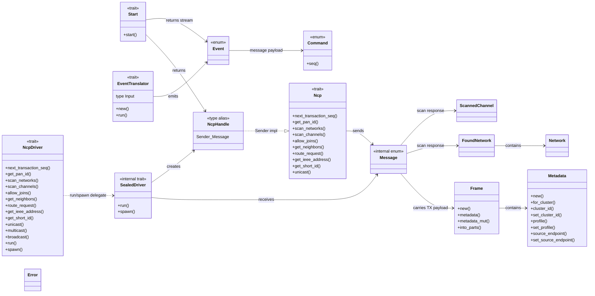
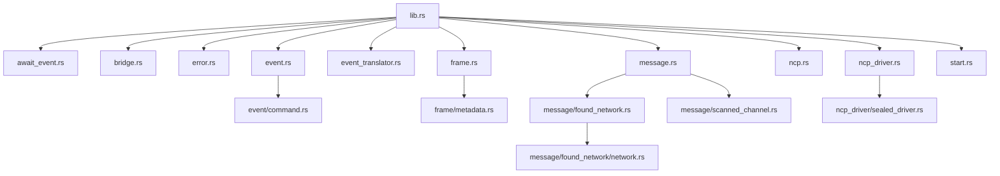

# zigbee-hw Architecture

`zigbee-hw` is the hardware abstraction crate between coordinator-level logic and concrete Zigbee network co-processor (NCP) drivers. It defines three main boundaries:

- `NcpDriver`: implementor-facing trait for concrete hardware backends.
- `Ncp`: caller-facing proxy trait implemented for the actor handle (`tokio::sync::mpsc::Sender<Message>`).
- `EventTranslator`: implementor-facing trait for converting hardware-specific events into common `Event` values.

The crate is actor-oriented. A driver implementing `NcpDriver` can be spawned into a Tokio task. Callers use the returned `NcpHandle` to send internal `Message` commands and receive oneshot responses through the `Ncp` extension trait.

## Public Re-Exports

`src/lib.rs` exposes the public API surface:

| Export | Defined in | Kind | Purpose |
| --- | --- | --- | --- |
| `AwaitEvent` | `await_event.rs` | trait | Convenience methods for waiting on common network events. |
| `bridge` | `bridge.rs` | function | Forwards and converts messages between two Tokio MPSC channels. |
| `Command` | `event/command.rs` | enum | Common APS payload command wrapper for received ZDP or ZCL frames. |
| `Error` | `error.rs` | enum | Common crate error type. |
| `Event` | `event.rs` | enum | Common hardware-layer event model. |
| `EventTranslator` | `event_translator.rs` | trait | Converts driver-specific event messages into `Event`. |
| `FoundNetwork` | `message/found_network.rs` | struct | Network scan result plus last-hop signal quality. |
| `Frame` | `frame.rs` | struct | Transmission-ready application frame plus APS metadata. |
| `Metadata` | `frame/metadata.rs` | struct | APS metadata for a `Frame`. |
| `Ncp` | `ncp.rs` | trait | Caller-side API implemented for `NcpHandle`. |
| `NcpDriver` | `ncp_driver.rs` | trait | Driver-side API implemented by hardware backends. |
| `NcpHandle` | `lib.rs` | type alias | `tokio::sync::mpsc::Sender<Message>`, the actor command handle. |
| `Network` | `message/found_network/network.rs` | struct | Basic network information discovered during scans. |
| `ScannedChannel` | `message/scanned_channel.rs` | struct | Channel scan result. |
| `Start` | `start.rs` | trait | High-level startup trait returning an `NcpHandle` and event stream. |

Internal modules define additional items used by the public API but not directly re-exported:

| Item | Defined in | Kind | Visibility | Purpose |
| --- | --- | --- | --- | --- |
| `Message` | `message.rs` | enum | `pub` inside private module | Internal actor command protocol. It is hidden because `message` is private, but appears in the concrete `NcpHandle` alias. |
| `SealedDriver` | `ncp_driver/sealed_driver.rs` | trait | `pub` inside private module | Blanket-implemented actor runtime for every `NcpDriver + Send + 'static`. |

## Component Relationships



## Actor Command Flow

```mermaid
sequenceDiagram
    participant Caller
    participant Handle as NcpHandle / Sender<Message>
    participant Actor as SealedDriver::run
    participant Driver as NcpDriver implementation

    Caller->>Handle: Ncp::scan_networks(channel_mask, duration)
    Handle->>Actor: Message::ScanNetworks { channel_mask, duration, response }
    Actor->>Driver: scan_networks(channel_mask, duration).await
    Driver-->>Actor: Result<Vec<FoundNetwork>, Error>
    Actor-->>Caller: oneshot response

    Caller->>Handle: Ncp::unicast(address, endpoint, frame)
    Handle->>Actor: Message::Unicast { address, endpoint, frame, response }
    Actor->>Driver: unicast(address, endpoint, frame).await
    Driver-->>Actor: Result<u8, Error>
    Actor-->>Caller: oneshot response
```

## Module Inventory



## Traits

### `Ncp`

Defined in `src/ncp.rs`. This is the caller-side proxy trait for communicating with an NCP actor. It is implemented for `tokio::sync::mpsc::Sender<Message>`, which is also exposed as `NcpHandle`.

Methods:

| Method | Signature summary | Internal message | Response |
| --- | --- | --- | --- |
| `next_transaction_seq` | `&self -> Future<Result<u8, Error>>` | `Message::GetTransactionSeq` | Next transaction sequence number. |
| `get_pan_id` | `&self -> Future<Result<u16, Error>>` | `Message::GetPanId` | Network PAN ID. |
| `scan_networks` | `&self, channel_mask: u32, duration: u8 -> Future<Result<Vec<FoundNetwork>, Error>>` | `Message::ScanNetworks` | Discovered networks and signal data. |
| `scan_channels` | `&self, channel_mask: u32, duration: u8 -> Future<Result<Vec<ScannedChannel>, Error>>` | `Message::ScanChannels` | Observed channel RSSI results. |
| `allow_joins` | `&self, duration: Duration -> Future<Result<(), Error>>` | `Message::AllowJoins` | Opens joining for `duration`. |
| `get_neighbors` | `&self -> Future<Result<BTreeMap<MacAddr8, u16>, Error>>` | `Message::GetNeighbors` | Neighbor IEEE-to-short-ID map. |
| `route_request` | `&self, radius: u8 -> Future<Result<(), Error>>` | `Message::RouteRequest` | Issues a route request. |
| `get_ieee_address` | `&self, short_id: u16 -> Future<Result<MacAddr8, Error>>` | `Message::GetIeeeAddress` | IEEE address for a short ID. |
| `get_short_id` | `&self, ieee_address: MacAddr8 -> Future<Result<u16, Error>>` | `Message::GetShortId` | Short ID for an IEEE address. |
| `unicast` | `&self, address: Address, endpoint: Endpoint, frame: Frame -> Future<Result<u8, Error>>` | `Message::Unicast` | Driver-specific transaction or sequence identifier. |

Implementation behavior:

- Each method creates a oneshot channel.
- It sends a corresponding `Message` variant over the MPSC actor handle.
- It awaits the oneshot response.
- MPSC send failures convert to `Error::DriverSend` through `From<SendError<T>>`.
- Oneshot receive failures convert to `Error::DriverRecv` through `From<RecvError>`.

### `NcpDriver`

Defined in `src/ncp_driver.rs`. This is the implementor-facing trait for concrete hardware backends. It exposes all operations that the actor can dispatch.

Required methods:

| Method | Signature summary | Purpose |
| --- | --- | --- |
| `next_transaction_seq` | `&mut self -> u8` | Returns the next transaction sequence number synchronously. |
| `get_pan_id` | `&mut self -> Future<Result<u16, Error>>` | Reads the current network PAN ID. |
| `scan_networks` | `&mut self, channel_mask: u32, duration: u8 -> Future<Result<Vec<FoundNetwork>, Error>>` | Performs active/passive network discovery. |
| `scan_channels` | `&mut self, channel_mask: u32, duration: u8 -> Future<Result<Vec<ScannedChannel>, Error>>` | Measures activity per Zigbee channel. |
| `allow_joins` | `&mut self, duration: Duration -> Future<Result<(), Error>>` | Opens permit-join for the provided duration. |
| `get_neighbors` | `&mut self -> Future<Result<BTreeMap<MacAddr8, u16>, Error>>` | Reads neighbor table data. |
| `route_request` | `&mut self, radius: u8 -> Future<Result<(), Error>>` | Requests route discovery with the given radius. |
| `get_ieee_address` | `&mut self, short_id: u16 -> Future<Result<MacAddr8, Error>>` | Resolves short ID to IEEE address. |
| `get_short_id` | `&mut self, ieee_address: MacAddr8 -> Future<Result<u16, Error>>` | Resolves IEEE address to short ID. |
| `unicast` | `&mut self, address: Address, endpoint: Endpoint, frame: Frame -> Future<Result<u8, Error>>` | Sends a unicast frame. |
| `multicast` | `&mut self, group_id: u16, hops: u8, radius: u8, frame: Frame -> Future<Result<u8, Error>>` | Sends a multicast frame. |
| `broadcast` | `&mut self, short_id: u16, radius: u8, frame: Frame -> Future<Result<u8, Error>>` | Sends a broadcast frame. `short_id` is currently a raw `u16`; the source notes that a dedicated broadcast address type may be needed. |

Provided methods:

| Method | Bounds | Purpose |
| --- | --- | --- |
| `run` | `Self: Sized + SealedDriver` | Delegates to `SealedDriver::run(self, rx)` to process actor messages. |
| `spawn` | `Self: Sized + SealedDriver + 'static` | Delegates to `SealedDriver::spawn(self, channel_size)` and returns `(JoinHandle<Self>, NcpHandle)`. |

### `SealedDriver` (internal)

Defined in `src/ncp_driver/sealed_driver.rs`. The module is private, so downstream users should not implement this trait directly. A blanket implementation exists for `T where T: NcpDriver + Send + 'static`.

Methods:

| Method | Signature summary | Purpose |
| --- | --- | --- |
| `run` | `self, Receiver<Message> -> Future<Self>` | Actor loop that receives `Message` values, calls the corresponding `NcpDriver` method, and sends the result through the message's oneshot response. Returns the driver when the command channel closes. |
| `spawn` | `self, channel_size: usize -> (JoinHandle<Self>, NcpHandle)` | Creates an MPSC channel, spawns `run(rx)` with `tokio::spawn`, and returns the task handle plus sender handle. |

Dispatch mapping:

| `Message` variant | Driver call |
| --- | --- |
| `GetTransactionSeq` | `next_transaction_seq()` |
| `GetPanId` | `get_pan_id().await` |
| `ScanNetworks` | `scan_networks(channel_mask, duration).await` |
| `ScanChannels` | `scan_channels(channel_mask, duration).await` |
| `AllowJoins` | `allow_joins(duration).await` |
| `GetNeighbors` | `get_neighbors().await` |
| `RouteRequest` | `route_request(radius).await` |
| `GetIeeeAddress` | `get_ieee_address(short_id).await` |
| `GetShortId` | `get_short_id(ieee_address).await` |
| `Unicast` | `unicast(address, endpoint, frame).await` |
| `Multicast` | `multicast(group_id, hops, radius, frame).await` |
| `Broadcast` | `broadcast(short_id, radius, frame).await` |

### `Start`

Defined in `src/start.rs`. This trait represents a higher-level startup contract for objects that can create both the NCP actor handle and the event receiver.

Methods:

| Method | Signature summary | Purpose |
| --- | --- | --- |
| `start` | `self -> Future<Result<(NcpHandle, Receiver<Event>), Error>>` | Starts the driver stack and returns a command handle plus common event stream. |

### `EventTranslator`

Defined in `src/event_translator.rs`. This trait is implemented by hardware-specific event translator components.

Associated types:

| Type | Purpose |
| --- | --- |
| `Input` | Hardware-specific input message type that will be converted into common `Event` values. |

Methods:

| Method | Signature summary | Purpose |
| --- | --- | --- |
| `new` | `output: Sender<Event> -> Self` | Constructs a translator that publishes common events into `output`. |
| `run` | `self, input: Receiver<Self::Input> -> Future<()> + Send` | Consumes hardware-specific event messages and emits `Event` values. |

### `AwaitEvent`

Defined in `src/await_event.rs`. This trait provides convenience methods for blocking until selected common events appear on an event stream. It is implemented for `tokio::sync::mpsc::Receiver<Event>`.

Methods:

| Method | Signature summary | Purpose |
| --- | --- | --- |
| `event` | `&mut self, expected_event: Event -> Future<Result<(), ()>> + Send` | Reads from the event stream until `expected_event` is received. Returns `Err(())` if the stream closes first. |
| `network_up` | `&mut self -> Future<Result<(), ()>> + Send` | Waits for `Event::NetworkUp`. |
| `network_down` | `&mut self -> Future<Result<(), ()>> + Send` | Waits for `Event::NetworkDown`. |
| `network_opened` | `&mut self -> Future<Result<(), ()>> + Send` | Waits for `Event::NetworkOpened`. |
| `network_closed` | `&mut self -> Future<Result<(), ()>> + Send` | Waits for `Event::NetworkClosed`. |

Implementation behavior:

- `Receiver<Event>::event` loops on `recv().await`.
- It returns `Ok(())` on the first event equal to the expected event.
- It returns `Err(())` if the channel closes before the expected event is seen.

## Structs

### `Frame`

Defined in `src/frame.rs`. Represents a transmission-ready ZCL or ZDP application frame plus APS metadata.

Fields:

| Field | Type | Visibility | Purpose |
| --- | --- | --- | --- |
| `aps_metadata` | `Metadata` | private | APS-level metadata needed by the NCP driver. |
| `payload` | `Box<[u8]>` | private | Serialized application payload. |

Methods:

| Method | Signature summary | Purpose |
| --- | --- | --- |
| `new` | `unsafe const fn new(aps_metadata: Metadata, payload: Box<[u8]>) -> Self` | Constructs a frame from metadata and raw payload. Unsafe because the caller must ensure metadata and payload are semantically consistent. |
| `metadata` | `const fn &self -> &Metadata` | Returns immutable metadata. |
| `metadata_mut` | `const fn &mut self -> &mut Metadata` | Returns mutable metadata. |
| `into_parts` | `fn self -> (Metadata, Box<[u8]>)` | Splits the frame into metadata and payload. |

Trait implementations:

| Implementation | Behavior |
| --- | --- |
| `From<zcl::Frame<T>> for Frame where T: zigbee::Cluster + ToLeStream` | Serializes the ZCL frame and uses `Metadata::new(T::ID, None, None)`. |
| `From<zdp::Frame<T>> for Frame where T: zigbee::Cluster + ToLeStream` | Serializes the ZDP frame and uses `Metadata::new(T::ID, Some(Profile::Network), Some(Endpoint::Data))`. |

### `Metadata`

Defined in `src/frame/metadata.rs`. Carries APS metadata associated with a `Frame`.

Fields:

| Field | Type | Visibility | Purpose |
| --- | --- | --- | --- |
| `cluster_id` | `u16` | private | APS cluster ID. |
| `profile` | `Option<zigbee::Profile>` | private | Optional APS profile ID. |
| `source_endpoint` | `Option<zigbee::Endpoint>` | private | Optional APS source endpoint. |

Methods:

| Method | Signature summary | Purpose |
| --- | --- | --- |
| `new` | `const fn new(cluster_id: u16, profile: Option<Profile>, source_endpoint: Option<Endpoint>) -> Self` | Constructs metadata directly. |
| `for_cluster` | `const fn for_cluster<T: Cluster>(profile: Option<Profile>, source_endpoint: Option<Endpoint>) -> Self` | Constructs metadata using `T::ID` as the cluster ID. |
| `cluster_id` | `const fn &self -> u16` | Returns the cluster ID. |
| `set_cluster_id` | `const fn &mut self, cluster_id: u16` | Updates the cluster ID. |
| `profile` | `const fn &self -> Option<Profile>` | Returns the optional profile. |
| `set_profile` | `const fn &mut self, profile: Profile` | Sets the profile to `Some(profile)`. |
| `source_endpoint` | `const fn &self -> Option<Endpoint>` | Returns the optional source endpoint. |
| `set_source_endpoint` | `const fn &mut self, source: Endpoint` | Sets the source endpoint to `Some(source)`. |

### `FoundNetwork`

Defined in `src/message/found_network.rs`. Represents a discovered network plus signal metadata for the last hop.

Fields:

| Field | Type | Visibility | Purpose |
| --- | --- | --- | --- |
| `network` | `Network` | private | Underlying network data. |
| `last_hop_lqi` | `u8` | private | Link quality indicator for the last hop. |
| `last_hop_rssi` | `i8` | private | RSSI for the last hop. |

Methods:

| Method | Signature summary | Purpose |
| --- | --- | --- |
| `new` | `const fn new(network: Network, last_hop_lqi: u8, last_hop_rssi: i8) -> Self` | Constructs a scan result. |
| `network` | `const fn &self -> &Network` | Returns the underlying network data. |
| `last_hop_lqi` | `const fn &self -> u8` | Returns last-hop LQI. |
| `last_hop_rssi` | `const fn &self -> i8` | Returns last-hop RSSI. |

### `Network`

Defined in `src/message/found_network/network.rs`. Represents information about a Zigbee network discovered during scanning.

Fields:

| Field | Type | Visibility | Purpose |
| --- | --- | --- | --- |
| `channel` | `u8` | private | Zigbee channel. |
| `pan_id` | `u16` | private | PAN ID. |
| `ieee_address` | `MacAddr8` | private | Extended PAN ID or network IEEE address as reported by the backend. |
| `allow_joins` | `bool` | private | Whether the network currently permits joins. |
| `stack_profile` | `u8` | private | Zigbee stack profile. |
| `nwk_update_id` | `u8` | private | Network update ID. |

Methods:

| Method | Signature summary | Purpose |
| --- | --- | --- |
| `new` | `const fn new(channel: u8, pan_id: u16, ieee_address: MacAddr8, allow_joins: bool, stack_profile: u8, nwk_update_id: u8) -> Self` | Constructs network metadata. |
| `channel` | `const fn &self -> u8` | Returns the channel. |
| `pan_id` | `const fn &self -> u16` | Returns the PAN ID. |
| `ieee_address` | `const fn &self -> MacAddr8` | Returns the IEEE address. |
| `allow_joins` | `const fn &self -> bool` | Returns whether joins are allowed. |
| `stack_profile` | `const fn &self -> u8` | Returns the stack profile. |
| `nwk_update_id` | `const fn &self -> u8` | Returns the network update ID. |

### `ScannedChannel`

Defined in `src/message/scanned_channel.rs`. Represents channel scan activity.

Fields:

| Field | Type | Visibility | Purpose |
| --- | --- | --- | --- |
| `channel` | `u8` | private | Zigbee channel number. |
| `max_rssi_value` | `i8` | private | Maximum observed RSSI value on this channel. |

Methods:

| Method | Signature summary | Purpose |
| --- | --- | --- |
| `new` | `const fn new(channel: u8, max_rssi_value: i8) -> Self` | Constructs a channel scan result. |
| `channel` | `const fn &self -> u8` | Returns the channel number. |
| `max_rssi_value` | `const fn &self -> i8` | Returns the maximum observed RSSI. |

## Enums

### `Error`

Defined in `src/error.rs`. Common error type for the hardware abstraction.

Variants:

| Variant | Payload | Purpose |
| --- | --- | --- |
| `Implementation` | `Arc<dyn std::error::Error + Send + Sync>` | Wraps implementation-specific backend errors. |
| `DriverSend` | none | Sending a message to the driver actor failed. |
| `DriverRecv` | none | Receiving a response from the driver actor failed. |
| `NotImplemented` | none | A requested feature is not implemented by the backend. |

Implementations:

| Implementation | Behavior |
| --- | --- |
| `Display` | Formats implementation errors through their own formatter; formats crate-level actor and missing-feature errors as fixed messages. |
| `std::error::Error` | Returns the wrapped source for `Implementation`; returns `None` for other variants. |
| `From<tokio::sync::oneshot::error::RecvError>` | Converts to `Error::DriverRecv`. |
| `From<tokio::sync::mpsc::error::SendError<T>>` | Converts to `Error::DriverSend`. |

### `Event`

Defined in `src/event.rs`. Common hardware-layer events emitted by an event translator.

Variants:

| Variant | Payload | Purpose |
| --- | --- | --- |
| `NetworkUp` | none | Network is up and running. |
| `NetworkDown` | none | Network is down. |
| `NetworkOpened` | none | Network has been opened for joining. |
| `NetworkClosed` | none | Network has been closed for joining. |
| `DeviceJoined` | `ieee_address: MacAddr8`, `short_id: u16` | A new device joined. |
| `DeviceRejoined` | `ieee_address: MacAddr8`, `short_id: u16`, `secured: bool` | A device rejoined, with security status. |
| `DeviceLeft` | `ieee_address: MacAddr8`, `short_id: u16` | A device left. |
| `MessageReceived` | `src_address: u16`, `aps_frame: Box<aps::Data<Command>>` | A message was received from a device. |

### `Command`

Defined in `src/event/command.rs`. Represents received APS-layer command payloads.

Variants:

| Variant | Payload | Purpose |
| --- | --- | --- |
| `Zdp` | `zdp::Frame<zdp::Command>` | A ZDP frame was received. |
| `Zcl` | `zcl::Frame<zcl::Cluster>` | A ZCL frame was received. |

Methods:

| Method | Signature summary | Purpose |
| --- | --- | --- |
| `seq` | `const fn &self -> u8` | Returns the sequence number. For ZDP, delegates to `zdp.seq()`. For ZCL, delegates to `zcl.header().seq()`. |

### `Message` (internal)

Defined in `src/message.rs`. This enum is the actor protocol between `Ncp` proxy calls and `SealedDriver::run`. It is public within a private module and not directly exported from the crate root.

Variants:

| Variant | Fields | Purpose |
| --- | --- | --- |
| `GetTransactionSeq` | `response: oneshot::Sender<u8>` | Request next transaction sequence number. |
| `GetPanId` | `response: oneshot::Sender<Result<u16, Error>>` | Request PAN ID. |
| `ScanNetworks` | `channel_mask: u32`, `duration: u8`, `response: oneshot::Sender<Result<Vec<FoundNetwork>, Error>>` | Request network scan. |
| `ScanChannels` | `channel_mask: u32`, `duration: u8`, `response: oneshot::Sender<Result<Vec<ScannedChannel>, Error>>` | Request channel scan. |
| `AllowJoins` | `duration: Duration`, `response: oneshot::Sender<Result<(), Error>>` | Request permit-join. |
| `GetNeighbors` | `response: oneshot::Sender<Result<BTreeMap<MacAddr8, u16>, Error>>` | Request neighbor table. |
| `RouteRequest` | `radius: u8`, `response: oneshot::Sender<Result<(), Error>>` | Request route discovery. |
| `GetIeeeAddress` | `short_id: u16`, `response: oneshot::Sender<Result<MacAddr8, Error>>` | Resolve short ID to IEEE address. |
| `GetShortId` | `ieee_address: MacAddr8`, `response: oneshot::Sender<Result<u16, Error>>` | Resolve IEEE address to short ID. |
| `Unicast` | `address: Address`, `endpoint: Endpoint`, `frame: Frame`, `response: oneshot::Sender<Result<u8, Error>>` | Send unicast frame. |
| `Multicast` | `group_id: u16`, `hops: u8`, `radius: u8`, `frame: Frame`, `response: oneshot::Sender<Result<u8, Error>>` | Send multicast frame. |
| `Broadcast` | `short_id: u16`, `radius: u8`, `frame: Frame`, `response: oneshot::Sender<Result<u8, Error>>` | Send broadcast frame. |

## Type Aliases

### `NcpHandle`

Defined in `src/lib.rs`:

```rust
pub type NcpHandle = tokio::sync::mpsc::Sender<Message>;
```

`NcpHandle` is the public actor handle used by coordinator code. Although its concrete alias mentions the internal `Message` type, users normally interact with it through the `Ncp` trait methods instead of constructing `Message` values directly.

## Functions

### `bridge`

Defined in `src/bridge.rs`:

```rust
pub async fn bridge<T, U>(input: Receiver<T>, output: Sender<U>)
where
    T: Into<U>
```

Behavior:

- Receives `T` values from `input` until the input channel closes.
- Converts each value with `Into<U>`.
- Sends converted values to `output`.
- Stops early if the output channel is closed.

## Data Flow Summary

Command-side flow:

1. A concrete driver implements `NcpDriver`.
2. The driver is started directly with `NcpDriver::spawn` or through a higher-level `Start::start` implementation.
3. `spawn` creates an internal `Receiver<Message>` plus public `NcpHandle`.
4. Caller code invokes `Ncp` methods on `NcpHandle`.
5. Each `Ncp` method sends a `Message` and awaits a oneshot response.
6. `SealedDriver::run` receives the `Message`, calls the corresponding `NcpDriver` method, and sends the result back.

Event-side flow:

1. A hardware backend emits implementation-specific event messages.
2. An `EventTranslator` consumes those messages from `Receiver<Self::Input>`.
3. The translator emits common `Event` values into `Sender<Event>`.
4. Coordinator code consumes `Receiver<Event>` directly or uses `AwaitEvent` helpers for common network state transitions.

Frame-side flow:

1. Coordinator code builds a `zcl::Frame<T>` or `zdp::Frame<T>`.
2. `Frame::from` serializes the application frame with `ToLeStream`.
3. `Metadata` records the cluster ID and, for ZDP, network profile/source endpoint defaults.
4. `NcpDriver` implementations receive `Frame` values in `unicast`, `multicast`, or `broadcast` and translate them into backend-specific transmit operations.
